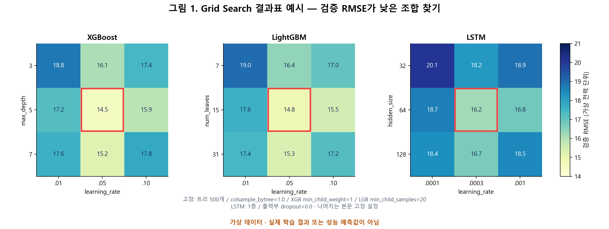
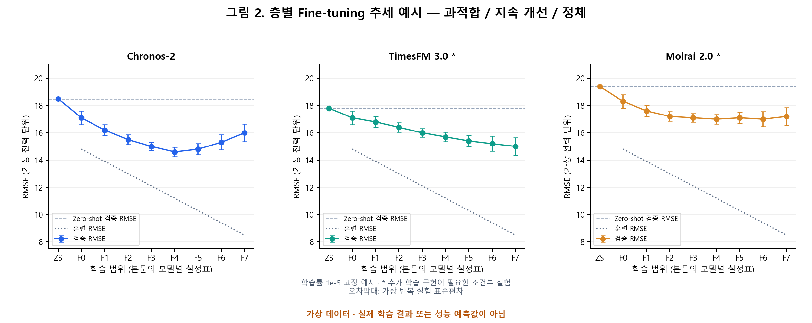
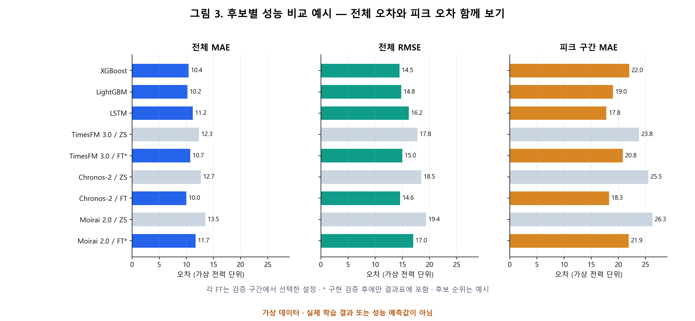
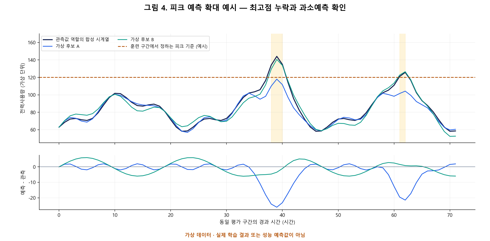
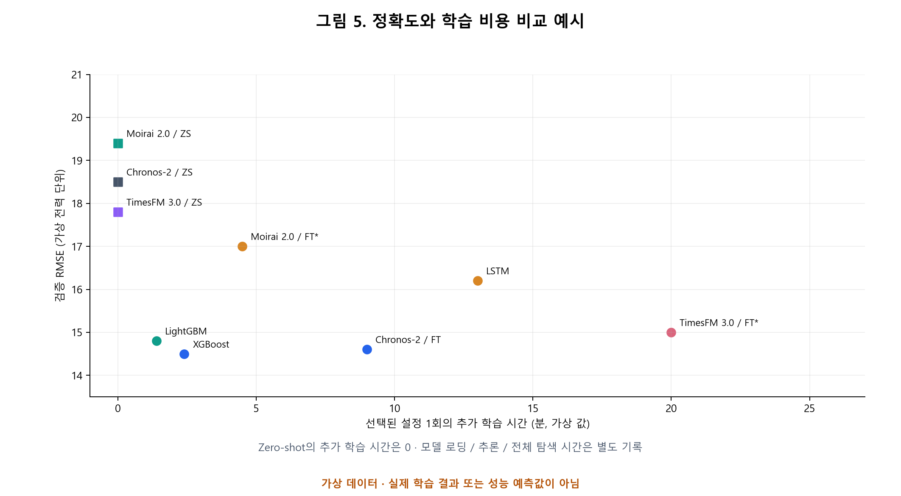

# 제조 생산데이터 기반 전력사용량 예측 모델 및 평가 지표 선정

> `compare-base9-models` 브랜치의 9개 변수 LSTM·TCN·앙상블·XGBoost·LightGBM 비교는 [BASE9_COMPARISON.md](BASE9_COMPARISON.md)를 참조하세요. 기존 `outputs/xgboost_lightgbm_summary/`는 이전 20개 변수 실험입니다.

2026년 10월 5일

## 1. 모델 후보 3개

세 모델을 **동일한 예측 구간, 입력 정보, 시간순 검증 구간**에서 모두 학습·비교한 뒤 최종 모델을 선정한다. 아래 논문 수치는 각 연구의 자료와 실험 조건에서 나온 결과이므로 모델 간 순위를 미리 정하는 데 사용하지 않는다.

| 모델 | 전력사용량 예측 논문에서의 사용 이력 | 논문 평가 지표 | 후보 선정 근거 |
|---|---|---|---|
| **XGBoost** | 철강공장 시간별 전력사용량 예측 연구에서 과거 24시간의 전력값을 입력해 시험했다. 연구가 보고한 XGBoost 결과는 RMSE 54.833 kWh, MAE 30.302 kWh, MAPE 74.57%다. [1] | RMSE, MAE, MAPE [1] | 생산·기상·달력·과거 전력처럼 형태가 다른 입력을 한 모델에 결합하고, 비선형 조건을 학습할 수 있다. |
| **LightGBM** | 여섯 지역의 시간별 전력부하를 대상으로 XGBoost와 순환신경망 등을 함께 비교한 연구가 있다. 스페인 1년 자료에서 LightGBM의 보고값은 nRMSE 2.31%, MAE 397.8, R² 0.98이다. [2] | nRMSE, MAE, R² [2] | XGBoost와 동일한 입력 조건에서 부스팅 방식의 차이를 비교할 수 있다. |
| **LSTM** | 같은 철강공장 연구에서 순차적인 과거 전력값을 입력해 시험했다. 연구가 보고한 LSTM 결과는 RMSE 49.826 kWh, MAE 28.139 kWh, MAPE 66.80%다. [1] | RMSE, MAE, MAPE [1] | 생산 및 전력 변화의 시간적 순서를 직접 학습하는 방식이 트리 모델보다 유리한지 검증할 수 있다. |

## 2. 사전학습 모델 3개와 전력사용량 예측 적용 이력

아래 세 모델도 동일한 평가 조건에서 비교할 수 있다. **전력 가격 예측이나 발전량 예측을 전력사용량 예측 이력으로 세지 않았다.** 적용 이력의 대상이 제조공장인지, 건물·고객·전력망인지 구분했다.

| 모델 | 2026년 기준 모델 특성 | 실제 전력사용량 예측 적용 이력 | 선정 근거 |
|---|---|---|---|
| **TimesFM 3.0** (2026년 8월 발표) | Google Research의 다변량 사전학습 모델. 과거 변수와 미래에 알려진 변수를 입력하고 점·분위수 예측을 생성한다. [4] | **있음 — 고객 전력소비 벤치마크.** 공식 TimesFM 3.0 GIFT-Eval 결과에 `electricity/W/short`, `electricity/D/short` 실험이 기록돼 있다. GIFT-Eval 논문이 정의한 Electricity 자료의 원천은 실제 고객 전력소비 기록이다. 제조공장 개별 자료의 검증은 아니다. [5, 6] | 생산계획 등 미래에 알려진 변수의 효과를 비교할 수 있다. 공개 가중치는 비상업·비운영 용도로 제한된다. [4, 7] |
| **Chronos-2** (2025년 10월 발표) | 단변량·다변량·공변량 포함 예측을 지원한다. [8] | **있음 — 실제 전력망 부하.** 2026년 연구가 ISO New England와 ENTSO-E 전력부하에 Chronos-2를 적용해 제로샷·미세조정 예측을 비교했다. 제로샷 성능은 해당 연구의 전용 학습 모델보다 낮았고, 미세조정 후 단기 예측은 개선됐다. [9] | 생산·기상·달력 변수의 활용과 사전학습 모델의 적응 효과를 함께 비교할 수 있다. |
| **Moirai 2.0** (가중치 2025년 8월 공개) | 분위수 예측을 제공한다. 원 논문은 변수를 독립된 단변량 시계열로 처리한다고 명시한다. [10, 11] | **있음 — 실제 전력망 부하.** 2026년 제로샷 비교 연구가 2020~2024년 ERCOT 시간별 전력부하에 Moirai-2를 적용했다. 512시간 입력·24시간 예측 조건에서 MASE 약 0.33을 보고했다. [12] | 전력 이력만 사용하는 사전학습 예측의 비교 기준이 된다. 생산·기상 변수의 공동 효과를 직접 모델링하는 후보는 아니다. |

TimesFM 3.0의 적용 근거는 **공식 공개 실험 결과와 GIFT-Eval 논문**이다. Chronos-2와 Moirai 2.0의 적용 근거는 **실제 부하 자료를 사용한 별도 연구 논문**이다. 세 적용 대상 모두 제조공장 전력사용량과 완전히 같지는 않으므로 최종 선정은 이 과제의 동일 조건 비교 결과로 결정한다.

### 사전학습 모델 라이선스

| 모델 | 공개 가중치 라이선스 | 코드 라이선스 및 사용 범위 |
|---|---|---|
| **TimesFM 3.0** | **TimesFM Non-Commercial License v1.0** [7] | 저장소 코드는 **Apache-2.0** [13]. 3.0 가중치는 비상업·비운영 사용으로 제한되며, 상업·운영 목적은 별도 허가가 필요하다. [7] |
| **Chronos-2** | **Apache-2.0** [14] | `chronos-forecasting` 코드도 **Apache-2.0** [15]. 라이선스 조건을 지키면 상업적 이용이 가능하다. |
| **Moirai 2.0-R-small** | **CC BY-NC 4.0** [16] | `uni2ts` 코드는 **Apache-2.0** [17]. 공개 가중치의 상업적 이용은 허용되지 않는다. [16] |

## 3. 평가 지표 선정

| 목적 | 지표 | 선택 근거 |
|---|---|---|
| 전체 구간의 평균 오차 | **MAE** = 절대오차의 평균 | 철강공장 [1], 지역 전력부하 [2], 조선소 최대수요전력 [3] 연구가 공통으로 사용한다. 원래 전력 단위의 평균 오차를 비교할 수 있다. |
| 큰 예측오차 | **RMSE** = 평균 제곱오차의 제곱근 | 철강공장 [1]과 조선소 피크 [3] 연구가 사용한다. 큰 오차에 더 큰 가중치를 준다. |
| 높은 전력사용량 구간 | **피크 구간 MAE** | 전체 MAE가 낮아도 높은 부하 구간의 오차는 클 수 있으므로 분리해 보고한다. 조선소 연구는 전체 오차와 상위 위험일 탐지를 함께 평가했다. [3] |

**비교 시 고정할 사항:** 예측 시작 시점과 예측 길이, 시간순 훈련·검증·시험 구간을 여섯 모델에 동일하게 적용한다. 여섯 모델 모두 전력 이력만 쓰는 공통 실험을 수행하고, 외생 변수를 받는 모델은 생산·기상·달력 변수를 추가한 확장 실험도 수행한다. 피크 구간의 기준값은 시험 구간을 보기 전에 훈련 구간에서 정한다. 전체 MAE·RMSE와 피크 구간 MAE를 함께 확인해 최종 모델을 선정한다. MAPE는 [1]에서, nRMSE·R²는 [2]에서 사용한 지표로 기록하되 공통 비교 지표로는 MAE와 RMSE를 사용한다.

## 4. 참고 문헌 및 공식 실험 자료

[1] “Comparative evaluation of several models for forecasting hourly electricity use in a steel plant,” *Scientific Reports*, 2026. https://doi.org/10.1038/s41598-026-43868-z

[2] “Forecasting load consumption: a comprehensive evaluation of deep learning and machine learning techniques,” *Electric Power Systems Research*, 2025. https://doi.org/10.1016/j.epsr.2025.111834

[3] K. Lee, J. Ahn, J. Lee, “Day-ahead industrial peak demand forecasting: A shipyard benchmark of deep learning forecasters and stacking ensembles,” *International Journal of Electrical Power & Energy Systems*, 2026. https://doi.org/10.1016/j.ijepes.2026.111933

[4] Google Research, “TimesFM-3: A zero-shot foundation model for multivariate forecasting,” 2026-08-31. https://research.google/blog/timesfm-3-a-zero-shot-foundation-model-for-multivariate-forecasting/

[5] Google Research, TimesFM 3.0 GIFT-Eval 공식 결과표. https://raw.githubusercontent.com/google-research/timesfm/master/timesfm3-usage/benchmarks/gift_eval/all_results.csv

[6] T. Aksu et al., “GIFT-Eval: A Benchmark For General Time Series Forecasting Model Evaluation,” arXiv:2410.10393, 2024. https://arxiv.org/abs/2410.10393

[7] Google Research, TimesFM 3.0 공개 가중치 라이선스. https://huggingface.co/google/timesfm-3.0-pytorch/blob/main/LICENSE

[8] A. F. Ansari et al., “Chronos-2: From Univariate to Universal Forecasting,” arXiv:2510.15821, 2025. https://arxiv.org/abs/2510.15821

[9] V. Pendyala et al., “Assessing Covariate-Informed Grid Load Forecasting with a Time-Series Foundation Model,” arXiv:2609.06656, 2026. https://arxiv.org/abs/2609.06656

[10] C. Liu et al., “Moirai 2.0: When Less Is More for Time Series Forecasting,” arXiv:2511.11698, 2025. https://arxiv.org/abs/2511.11698

[11] Salesforce AI Research, Uni2TS 공식 저장소. https://github.com/SalesforceAIResearch/uni2ts

[12] L. Simeone, “Time Series Foundation Models for Energy Load Forecasting on Consumer Hardware: A Multi-Dimensional Zero-Shot Benchmark,” arXiv:2602.10848, 2026. https://arxiv.org/abs/2602.10848

[13] Google Research, TimesFM 코드 라이선스. https://github.com/google-research/timesfm/blob/master/LICENSE

[14] Amazon, Chronos-2 공식 모델 카드. https://huggingface.co/amazon/chronos-2

[15] Amazon Science, Chronos 코드 라이선스. https://github.com/amazon-science/chronos-forecasting/blob/main/LICENSE

[16] Salesforce AI Research, Moirai 2.0-R-small 공식 모델 카드. https://huggingface.co/Salesforce/moirai-2.0-R-small

[17] Salesforce AI Research, Uni2TS 코드 라이선스. https://github.com/SalesforceAIResearch/uni2ts/blob/main/LICENSE.txt

## 5. 하이퍼파라미터 탐색 및 층별 미세조정 실험 설계

### 5.1 비교 조건과 선정 절차

아래 수치는 이 과제의 탐색 제안값이다. 논문에서 검증된 최적값이나 이번 데이터로 학습해 얻은 결과를 뜻하지 않는다. 파라미터의 의미와 구현 가능 여부는 공식 문서·모델 설정·소스 코드로 확인했다. 확인일은 2026년 10월 5일이다.

| 항목 | 제안하는 공통 조건 |
|---|---|
| 예측 과제 | 시간 단위 관측을 전제로 과거 168시간을 입력하고 이후 24시간을 예측한다. 실제 사용 시점에 맞춰 예측 길이를 바꾸면 모든 후보에 함께 적용한다. |
| 예측 시작 시점 | 동일한 시각에서 24시간 간격으로 예측해 평가 대상 구간이 중복되지 않게 한다. 트리 모델은 예측 시차별 직접 예측, LSTM은 24개 값을 출력하는 구조를 사용한다. |
| 공통 입력 | 먼저 전력 이력만으로 여섯 후보를 비교한다. 생산·기상·달력 추가 실험은 지원 모델끼리 별도 표에 기록한다. 미래 생산량 실적과 미래 실제 기온은 입력할 수 없으며, 예측 당시 확정된 계획·달력·기상예보만 사용한다. |
| 시간순 분할 | 마지막 20%를 최종 시험 구간으로 보관한다. 앞 80%에서 학습 구간이 늘어나는 3개 검증 fold를 만든다. 모든 모델에 같은 날짜 경계를 사용한다. [18, 19] |
| 평가 구간 | 훈련·검증·시험의 정답 시각이 겹치지 않도록 구분한다. 평가 지표는 원래 전력 단위로 계산한다. |
| 피크 정의 | 각 fold 훈련 전력의 95백분위수를 기준값으로 정하고, 실제 관측값이 기준 이상인 평가 시점에서 MAE를 계산한다. 최종 기준값은 시험 이전 훈련 자료로 확정한다. 피크 표본 수를 함께 기록하고, 표본이 없으면 N/A로 표시한다. |
| 설정 선택 | 검증 RMSE를 기본 선택 기준으로 사용한다. 최저 RMSE 대비 2% 이내 후보에서 피크 구간 MAE가 작은 설정을 고르고, 전체 MAE와 시간 비용도 확인한다. 2%는 본 과제의 사전 결정 규칙 제안이며 논문에서 정한 기준은 아니다. |
| 최종 확인 | 모델 종류와 설정은 검증 결과로 선택한다. 선택 완료 후 시험 구간에서 후보별 성능을 한 번 확인하고 결과에 맞춰 탐색 범위를 다시 수정하지 않는다. 시험 결과를 보고 재선정하면 그 구간은 추가 검증 자료가 되므로 새 시험 구간이 필요하다. |

학습 과정의 조기 종료에는 fold 훈련 구간 끝의 별도 시간순 구간을 사용한다. 설정 비교용 검증 구간과 최종 시험 구간을 조기 종료용 자료로 반복 사용하지 않는다. 최종 학습에서는 내부 검증으로 선택한 학습 횟수를 사용해 시험 이전 자료로 다시 학습한다.

### 5.2 XGBoost·LightGBM·LSTM Grid Search

각 표에 제시한 값의 모든 조합을 탐색한다. 공통 입력 길이는 168시간으로 고정해 구조·학습률의 효과를 먼저 비교한다. 입력 길이를 추가 탐색한다면 24·72·168시간을 별도 실험 축으로 두고, 최대 입력 길이에 맞춰 평가 시작 시점을 통일한다.

| 모델 | 탐색 파라미터 | 후보 값 | 확인하려는 효과 |
|---|---|---|---|
| XGBoost | max_depth | 3, 5, 7 | 트리 복잡도와 과적합 |
| XGBoost | learning_rate | 0.01, 0.05, 0.1 | 업데이트 크기 |
| XGBoost | n_estimators | 200, 500, 1000 | 학습률과 트리 수의 조합 |
| XGBoost | min_child_weight | 1, 5 | 작은 표본 집단에 대한 분할 억제 |
| XGBoost | colsample_bytree | 0.8, 1.0 | 입력 변수 일부 사용의 효과 |
| LightGBM | num_leaves | 7, 15, 31 | 잎 개수에 따른 표현력 |
| LightGBM | learning_rate | 0.01, 0.05, 0.1 | 업데이트 크기 |
| LightGBM | n_estimators | 200, 500, 1000 | 학습률과 트리 수의 조합 |
| LightGBM | min_child_samples | 20, 50 | 잎에 필요한 최소 표본 수 |
| LightGBM | colsample_bytree | 0.8, 1.0 | 입력 변수 일부 사용의 효과 |
| LSTM | hidden_size | 32, 64, 128 | 은닉 상태 크기 |
| LSTM | num_layers | 1, 2 | 순환층 깊이 |
| LSTM | learning_rate | 0.0001, 0.0003, 0.001 | 최적화 속도와 안정성 |
| LSTM | head_dropout | 0.0, 0.2 | 마지막 은닉 상태와 출력층 사이의 dropout |

XGBoost는 108개, LightGBM은 108개, LSTM은 36개 조합이다. 3개 fold에서 각각 324회·324회·108회의 설정 평가를 수행한다. 예측 길이 24의 직접 예측 트리 방식에서는 설정·fold마다 24개 회귀기를 학습하므로 트리 회귀기 학습 수는 모델별 7,776회다. 최종 재학습과 반복 seed 확인은 이 수에 추가된다. 데이터 크기만으로 전체 탐색 시간을 단정하지 않고 첫 설정의 실측 시간을 기록한다.

고정 설정은 XGBoost의 objective=reg:squarederror, tree_method=hist, subsample=1.0, reg_lambda=1.0, reg_alpha=0.0이다. LightGBM은 objective=regression, max_depth=-1, subsample=1.0, reg_lambda=1.0, reg_alpha=0.0으로 고정한다. 기본 탐색에서는 n_estimators를 정확한 트리 수로 비교하며 트리 조기 종료를 함께 적용하지 않는다. 깊이·잎 수·최소 표본 수는 공식 문서가 설명하는 복잡도 조절 인자다. [20, 21]

LSTM은 단방향, batch_size=32, Adam, MSE 학습 손실, 최대 100 epoch, 내부 검증 RMSE 기준 patience=10으로 제안한다. num_layers=1에서도 dropout 효과를 비교할 수 있도록 PyTorch LSTM 내부 dropout은 0으로 고정하고 별도 출력부 dropout을 둔다. 내부 dropout은 마지막 층을 제외한 층 사이에 적용되기 때문이다. [22]

XGBoost·LightGBM은 GridSearchCV와 시간순 분할을 사용하고, LSTM은 ParameterGrid로 동일한 전체 조합을 순회하는 학습 루프를 사용한다. 탐색 시 seed=42를 고정하고, 모델별 상위 설정 3개는 seed=17·42·73으로 확인한다. 평균과 표준편차는 fold 간 변동과 seed 간 변동을 구분해 기록한다. 그리드 가장자리 값이 가장 좋으면 시험 구간을 열기 전에 해당 축을 확장한다.

### 5.3 사전학습 모델의 층별 구성 확인

층 비교의 단위는 attention·feed-forward·정규화를 포함하는 Transformer 블록이다. 블록 내부의 개별 선형층 개수로 세지 않는다. 아래 경로는 핵심 모델 객체 기준이며 외부 pipeline의 접두 경로는 제외했다.

| 모델 | 확인된 블록 수 / 경로 | 출력부 | 미세조정 구현 상태 |
|---|---|---|---|
| Chronos-2 | 12개 / encoder.block | output_patch_embedding + encoder.final_layer_norm | 공식 fit은 full·LoRA를 지원한다. 층별 동결 옵션은 별도 구현이 필요하다. [23–25] |
| TimesFM 3.0 | 20개 / transformer_stack.layers | output_head | 공식 PyTorch 코드는 inference only로 명시됐다. forward는 공개되어 있으나 학습 손실·학습 루프의 별도 구현과 검증이 필요하다. [26–28] |
| Moirai 2.0-R-small | 6개 / encoder.layers | out_proj + encoder.norm | 모듈 forward에 training_mode가 있으나 확인된 일반 fine-tuning 예제는 Moirai 1 계열이다. 2.0용 손실·학습 래퍼를 연결해야 한다. [29–32] |

Chronos-2의 fit은 모델을 새로 생성하고 가중치를 복사한다. 호출 전 원본 모델의 requires_grad만 바꾸면 동결 설정이 새 모델에 이어지지 않을 수 있다. 복사한 실제 학습 모델에서 층을 지정하고 optimizer를 만들기 전에 동결을 적용해야 한다. [25]

TimesFM 3.0의 decode는 no_grad 경로이므로 이를 그대로 학습 루프로 사용하지 않는다. forward를 이용하는 학습 경로에서 역전파를 검증해야 한다. 기존 2.5용 LoRA 예제를 3.0에 그대로 적용했다고 기록할 수 없다. [27]

Moirai 2.0은 전력 이력 공통 비교에 사용한다. 생산 변수를 공동 입력하는 확장 비교에는 포함하지 않는다. [10, 30]

### 5.4 모델별 9개 학습 범위

각 실험은 동일한 원본 사전학습 가중치에서 독립적으로 시작한다. 한 실험의 학습 결과를 다음 실험의 초기값으로 넘기지 않는다. ZS는 가중치를 업데이트하지 않으며, F0–F7은 학습하는 파라미터 범위만 다르게 설정한다. 출력부에는 위 표의 마지막 정규화층도 포함한다.

| 설정 | Chronos-2 (12블록) | TimesFM 3.0 (20블록) | Moirai 2.0 (6블록) |
|---|---|---|---|
| ZS | Zero-shot | Zero-shot | Zero-shot |
| F0 | 출력부만 | 출력부만 | 출력부만 |
| F1 | 마지막 1블록 + 출력부 | 마지막 1블록 + 출력부 | 마지막 1블록 + 출력부 |
| F2 | 마지막 2블록 + 출력부 | 마지막 2블록 + 출력부 | 마지막 2블록 + 출력부 |
| F3 | 마지막 3블록 + 출력부 | 마지막 5블록 + 출력부 | 마지막 3블록 + 출력부 |
| F4 | 마지막 6블록 + 출력부 | 마지막 10블록 + 출력부 | 마지막 4블록 + 출력부 |
| F5 | 마지막 9블록 + 출력부 | 마지막 15블록 + 출력부 | 마지막 5블록 + 출력부 |
| F6 | 12블록 + 출력부 | 20블록 + 출력부 | 6블록 + 출력부 |
| F7 | 입력부를 포함한 전체 | 입력부를 포함한 전체 | 입력부를 포함한 전체 |

F0–F6에서는 입력 임베딩·입력 투영부를 고정한다. F6과 F7은 전체 블록을 학습한다는 점은 같지만 F7에서만 입력부 등 남은 파라미터도 학습한다. 이 구분으로 입력 변환까지 바꿀 필요가 있는지 확인한다. 마지막 k개 블록은 0부터 시작하는 인덱스에서 [전체 블록 수−k, 전체 블록 수−1]이다. F0의 k=0은 별도 처리해 전체 블록이 선택되지 않게 한다.

학습률은 각 F 설정에서 1e−6·1e−5·1e−4의 동일한 세 값을 탐색한다. context=168, horizon=24, 유효 batch_size=32, 최대 1,000 optimizer step, 100 step마다 내부 검증, 개선 없는 3회 검증 후 종료를 초기 조건으로 제안한다. 검증 RMSE가 계속 감소하면 최적점이 관측되지 않은 것으로 보고 시험 평가 전에 모든 범위에 같은 확대 규칙을 적용한다. 모델마다 실제 메모리에 맞춰 작은 batch와 gradient accumulation을 사용하고 유효 batch는 유지한다.

층 수만의 영향을 보는 그래프는 같은 학습률의 곡선을 함께 남긴다. 범위별 최고 결과를 보여주는 곡선에는 각 범위에서 검증으로 선택한 학습률을 표기한다. 두 종류를 구분해야 학습률 효과를 층 효과로 오해하지 않는다. 각 모델의 학습 손실은 범위 간 동일하게 유지한다. Chronos-2는 공식 학습 손실을 유지하고, 별도 학습 구현이 필요한 두 모델은 중앙값 출력의 MSE를 사용하는 점예측 적응안을 제안한다. 이 손실 선택은 원 논문 재현 조건이 아니라 본 과제의 제안 조건으로 기록한다.

미세조정이 구현된 모델마다 8범위 × 3학습률 × 3fold = 72회 학습을 수행한다. ZS는 별도로 같은 평가 구간에서 추론한다. 검증 상위 범위·학습률 3개는 seed=17·42·73으로 재확인한다. 모델별 층 수 비율은 파라미터 수 비율과 다르므로 실제 학습 파라미터 개수·비율도 기록한다. LoRA는 이번 범위 비교에 섞지 않고 필요할 때 독립된 추가 실험으로 둔다.

실행 전 한 batch에서 유한한 손실과 gradient가 나오는지, 지정한 파라미터만 업데이트되는지, 동결 파라미터가 그대로인지, 저장 후 예측이 재현되는지 확인한다. zero-shot 학습 래퍼와 공식 추론의 출력 정렬도 확인한다. 이 확인을 통과한 구현만 층별 결과표에 포함한다. TimesFM 3.0·Moirai 2.0의 층별 설정은 해당 학습 구현 검증을 전제로 한 실험안이다.

## 6. 결과 그래프 예시와 모델 선정에 사용할 산출물

이 절의 모든 그래프는 결과물의 형태와 해석 방법을 보여주는 가상 데이터다. 실제 학습 결과, 문헌 성능 수치, 후보별 예상 순위를 나타내지 않는다. 실제 값은 실험 후 원래 전력 단위로 대체한다. 특정 모델이 반드시 우세하거나 전체 미세조정이 항상 좋아진다고 가정하지 않는다.

### 6.1 Grid Search 결과

각 칸은 특정 파라미터 조합의 3개 검증 fold 평균 RMSE다. 그림은 나머지 파라미터를 고정한 단면이다. 실제 탐색에서는 모든 조합을 CSV로 보관하고, 선택한 단면의 고정값도 제목에 기록한다. 최저 오차 주변에도 좋은 조합이 모이는지, 최적값이 탐색 범위 가장자리에 있는지 확인한다. 표준편차가 큰 조합은 추가 seed 결과와 함께 판단한다.

### 6.2 학습 층 범위에 따른 추세

세 패널은 각각 과적합 가능성, 계속되는 개선, 성능 정체라는 서로 다른 가상 추세를 보여준다. 실제 모델의 반응을 예측한 그림은 아니다. 훈련 오차만 줄고 검증 오차가 커지면 더 많은 층을 학습하는 설정을 선택할 근거가 약하다. 검증 오차가 비슷하면 학습 시간이 짧고 변동이 작은 범위를 고려한다. ZS의 훈련 오차는 정의하지 않으며, 오차막대는 표준편차로 표시하고 신뢰구간이라고 부르지 않는다.

### 6.3 모델별 전체·피크 오차 비교

각 모델의 검증으로 선택한 설정을 한 행에 두고, 사전학습 모델은 ZS와 선택된 FT를 각각 기록한다. 전체 RMSE 순위와 피크 MAE 순위가 다를 수 있으므로 세 지표를 함께 본다. 공통 전력 이력 실험과 외생 변수 확장 실험은 그림을 분리한다. 구현 검증을 통과하지 못한 FT는 실제 결과표에 수치를 채우지 않는다. 최종 시험 그래프는 선정 완료 후 확인용으로 작성한다.

### 6.4 실제값과 예측값의 시간별 비교

위 패널에서 피크 높이와 발생 시점이 맞는지 확인하고, 아래 패널에서 음수 오차가 피크 주변에 집중되는지 확인한다. 음수는 과소예측이다. 실제 그래프는 전체 시험 구간과 사전 정의한 피크 사건 창을 모두 제공한다. 예측이 잘 맞는 구간만 골라 최종 선정을 설명하지 않는다. 이 예시의 120 기준은 가상 값이며 실제 기준은 훈련 자료에서 계산한다.

### 6.5 정확도와 학습 비용 비교

이 그림은 선택된 설정 1회의 추가 학습 시간과 검증 RMSE를 비교한다. Zero-shot은 추가 학습 시간이 0이지만 로딩·추론 시간은 발생한다. 실제 결과에는 전체 탐색 시간, 선택 설정 재학습 시간, 동일 장비의 추론 지연을 별도로 기록한다. 두 모델이 모두 더 낮은 오차와 더 짧은 시간을 갖는지 확인하고, 성능 차이가 작으면 운영 조건에 맞는 비용을 검토한다.

### 6.6 모델 선정용 결과표

| 산출물 | 반드시 기록할 내용 | 선정에 사용하는 방법 |
|---|---|---|
| 모든 탐색 결과 CSV | 모델·입력 조건·fold·seed·파라미터·학습 범위·학습률·검증 MAE/RMSE/피크 MAE·피크 표본 수 | 최저값 하나뿐 아니라 안정적인 설정인지 확인 |
| 예측값 CSV | 예측 시작 시각·정답 시각·예측 시차·관측값·예측값·피크 여부·모델·실험 ID | 같은 대상 시각을 예측했는지 확인하고 오차 재계산 |
| 학습 범위 기록 | 학습한 모듈 이름·블록 인덱스·학습 가능/전체 파라미터 수·학습률·step·손실 | 층별 변화와 학습률 변화의 원인 구분 |
| 후보별 요약표 | 검증 세 지표·fold/seed별 변동·시험 세 지표·ZS 대비 FT 변화 | 검증으로 선정하고 최종 시험에서 일반화 성능 확인 |
| 비용 및 재현 기록 | 전체 탐색/선택 설정 학습/추론 시간·장비·최대 메모리·라이브러리 버전·가중치 revision | 반복 실행과 사용 환경의 실행 가능성 확인 |

선정 순서는 ① 공통 입력·동일 시각 평가 확인 → ② 검증 RMSE 최저 대비 2% 이내 후보 확인 → ③ 피크 MAE와 전체 MAE·변동 비교 → ④ 학습·추론 비용 및 기존 라이선스 조건 확인 → ⑤ 모델·설정 확정 → ⑥ 최종 시험 성능 보고다. 그래프의 가상 수치로 우선 후보를 정하지 않는다.

## 7. 실험 설계 추가 근거

[18] scikit-learn, GridSearchCV. https://scikit-learn.org/stable/modules/generated/sklearn.model_selection.GridSearchCV.html

[19] scikit-learn, TimeSeriesSplit. https://scikit-learn.org/stable/modules/generated/sklearn.model_selection.TimeSeriesSplit.html

[20] XGBoost, Parameters. https://xgboost.readthedocs.io/en/stable/parameter.html

[21] LightGBM, Parameters Tuning. https://lightgbm.readthedocs.io/en/stable/Parameters-Tuning.html

[22] PyTorch, LSTM. https://docs.pytorch.org/docs/2.9/generated/torch.nn.LSTM.html

[23] Amazon, Chronos-2 checkpoint configuration. https://huggingface.co/amazon/chronos-2/blob/main/config.json

[24] Amazon Science, Chronos2Model / Chronos2Encoder. https://github.com/amazon-science/chronos-forecasting/blob/main/src/chronos/chronos2/model.py

[25] Amazon Science, Chronos2Pipeline.fit. https://github.com/amazon-science/chronos-forecasting/blob/main/src/chronos/chronos2/pipeline.py

[26] Google Research, TimesFM 3.0 checkpoint configuration. https://huggingface.co/google/timesfm-3.0-pytorch/blob/main/config.json

[27] Google Research, TimesFM3Torch. https://github.com/google-research/timesfm/blob/master/src/timesfm3/torch/model.py

[28] Google Research, StackedMixingTransformer. https://github.com/google-research/timesfm/blob/master/src/timesfm3/torch/transformer.py

[29] Salesforce, Moirai 2.0-R-small checkpoint configuration. https://huggingface.co/Salesforce/moirai-2.0-R-small/blob/main/config.json

[30] Salesforce AI Research, Moirai2Module. https://github.com/SalesforceAIResearch/uni2ts/blob/main/src/uni2ts/model/moirai2/module.py

[31] Salesforce AI Research, TransformerEncoder. https://github.com/SalesforceAIResearch/uni2ts/blob/main/src/uni2ts/module/transformer.py

[32] Salesforce AI Research, Uni2TS fine-tuning example. https://github.com/SalesforceAIResearch/uni2ts/blob/main/README.md#fine-tuning
