# OKM 제조공정 전력 피크 예측: 심사기준별 결과보고서

## □ 제1장. 데이터 이해 및 진단〔15점〕

◦ 1.1 제조 데이터와 예측 과제

- 관측 단위는 공장 전체의 시간별 제조공정 기록이다. 2021년 1월 1일~9월 14일 총 6,168시간에 대해 생산량, 기상, 인력 및 15·30·45·60분 전력 계측을 시간 키로 연결한다. 네 전력 계측의 실수 평균을 다음 시간의 예측 목표(kW)로 정의하였다.

- 일별 평균 전력과 생산량을 함께 그려 1~9월 조업 수준의 변동을 살폈다. 생산량이 낮은 날에도 전력 소비가 이어지는 구간과 8월 말 셧다운 구간을 구분하여 해석했다.

그림 1. 일별 평균 전력과 생산량의 동시 변화

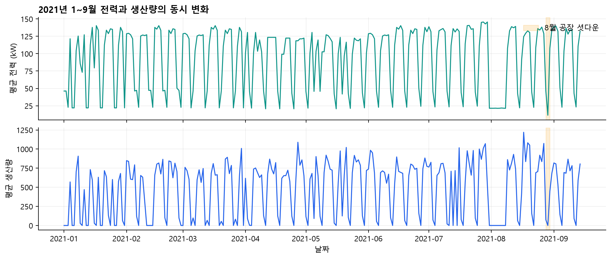

- 과거 전력은 설비 부하의 연속성, 생산량은 작업 강도, 기온·풍속·습도·강수량은 외부 조건, 시간 주기와 주말 구분은 조업 일정을 설명한다. 공장 단위 집계에서 생산 활동과 전력 사용 패턴을 함께 파악해 피크 사전경보에 연결하였다.

◦ 1.2 결측·중복·시간 이상 진단과 정제

- 원본 6,168행·18열에서 풍속 3건, 강수량 1건, 공장인원 17건의 결측과 시간 표기 이상 48건을 확인하였다. 완전 중복 행과 중복 시각은 각각 0건이었다.

- 시간 표기를 날짜·요일과 연속성에 맞춰 복원하고 원래 값과 복원 여부를 함께 기록했다. 공장인원 결측은 0으로, 풍속·강수량은 시간 순서의 선형보간으로 보정하였다. 네 계측값으로 전력 실수 평균을 재계산하고 공장 셧다운 17시간을 표기했다. 정제 후 6,168행·22열의 결측은 0건이다.

그림 2. 원본 결측과 셧다운 전후 전력 진단

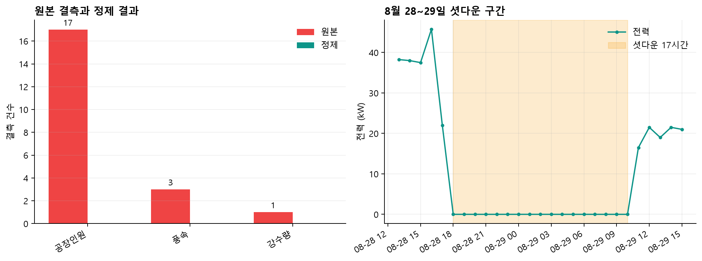

- 원본 결측 위치와 셧다운 전후 전력 추이를 확인했다. 셧다운을 제외한 생산량 0인 2,640시간의 평균 전력은 46.4 kW였다. 따라서 생산 중단과 공장 셧다운의 전력 상태를 구분해 진단했다.

◦ 1.3 입력과 피크 불균형

- 공통 입력은 과거 전력_평균_실수, 생산량, 기온, 풍속, 습도, 강수량, 시간_sin, 시간_cos, 주말여부의 9개다. 시간_sin·cos와 주말여부는 날짜·시간에서 동일한 규칙으로 생성한다. 모든 모델에 동일한 변수 정의와 시각 경계를 적용하였다.

- 요일×시간 평균 전력에서는 평일 11시 151.7 kW에서 12시 94.4 kW로 낮아지는 조업 리듬이 나타났다. 생산량과 전력의 산점도에서는 무생산 대기 부하와 높은 생산량의 고부하를 함께 확인했다. 전력의 1시간·168시간 시차 상관은 각각 0.901·0.740으로, 짧은 연속성과 주간 반복성이 입력 길이 비교의 근거가 되었다.

그림 3. 요일·시간별 평균 전력 열지도

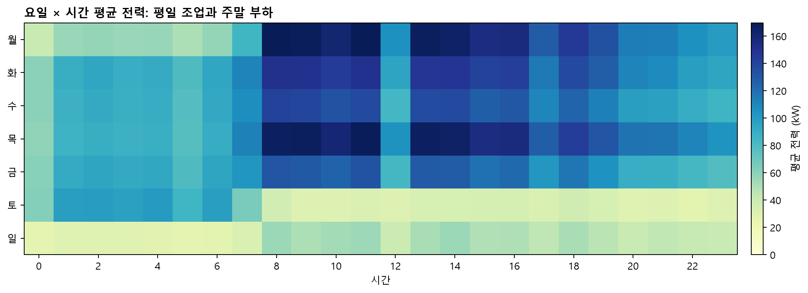

그림 4. 생산량과 전력 부하·대기 부하 분포

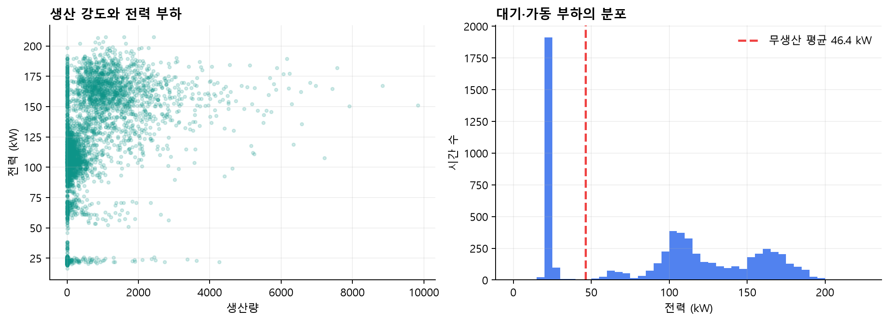

그림 5. 평일과 주말의 시간별 평균 전력 패턴

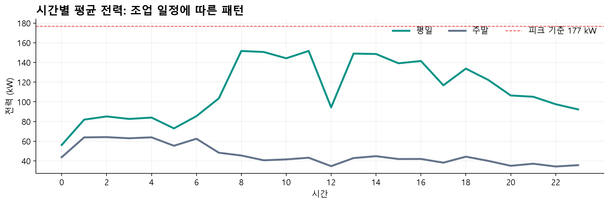

- 학습 기간의 높은 전력 구간을 기준으로 피크를 177 kW 이상으로 고정했다. 최종 Test의 유효한 703시간 중 피크는 49시간(7.0%)으로 소수 사례다. 따라서 전체 전력 오차와 함께 피크 F1·재현율·오경보를 별도로 평가하였다.

◦ 1.4 시계열 검증 설계

- 검증은 5월 16일~6월 15일, 6월 16일~7월 15일, 7월 16일~8월 15일의 확장형 3개 fold로 구성했다. 각 검증 시작 직전 14일은 조기 종료 판단 구간으로 두고 이전 기간으로 학습했다. 최종 Test는 8월 16일~9월 14일에 고정하여 탐색과 분리하였다.

## □ 제2장. AI 예측모델 개발 및 성능평가〔40점〕

◦ 2.1 기준선과 공통 선택 규칙

- 같은 Test 703시간에서 전주 같은 시각의 전력을 예측값으로 쓰는 기준선의 RMSE는 12.40 kW, MAE는 8.26 kW, 피크 F1은 0.274이다. 이를 다섯 후보의 실효 개선 기준으로 삼았다.

- seed 42와 3개 시간순 fold를 공통으로 적용했다. 각 후보의 검증 RMSE 평균 최솟값에서 2% 이내인 설정을 모은 다음 피크 시각 MAE가 가장 낮은 설정을 채택했다. 동률에서는 전체 RMSE가 낮은 설정을 우선한다. 경보 확률의 기준값도 검증 자료의 F1으로 정했다.

◦ 2.2 LSTM·TCN의 4단계 탐색

- LSTM은 입력 길이 → 은닉 유닛·층 → 학습률·dropout → 배치 크기의 4단계로 탐색했다. 단계별 전체 후보값과 최종 선택값은 표 1에 한눈에 비교하도록 정리했다. 중복 설정을 합쳐 22개 고유 후보·66개 fold 결과를 기록했다.

- LSTM의 단계별 선택 검증 RMSE는 12.90 → 12.33 → 12.19 → 12.20 kW였다. 최종 입력 168시간, 유닛 128, 2층, dropout 0.3, 학습률 0.001, 배치 16을 선택했다. 최종 설정의 검증 피크 MAE는 15.64 kW다.

표 1. LSTM Grid Search 파라미터 후보값과 최종 선택

| 항목 | 내용 |
|---|---|
| 탐색 방식 | 4단계 순차 탐색 · 각 단계 3개 시간순 fold |
| 입력 길이 | 24 · 48 · 72 · 168시간 |
| 모델 구조 | hidden_units: 32 · 64 · 128 / num_layers: 1 · 2 |
| 최적화 | learning_rate: 0.0001 · 0.0003 · 0.001 / dropout: 0 · 0.1 · 0.2 · 0.3 |
| 배치 크기 | 16 · 32 · 64 |
| 탐색 규모 | 22개 고유 후보 · 66개 fold 결과 |
| 단계별 RMSE | 12.90 → 12.33 → 12.19 → 12.20 kW |
| 최종 선택 | 168시간 / 128유닛 / 2층 / lr 0.001 / dropout 0.3 / batch 16 |
| 검증 성능 | RMSE 12.20 kW / 피크 MAE 15.64 kW |

- TCN도 입력 길이 → 필터·커널·팽창 패턴 → 학습률·dropout → 배치 크기 순으로 탐색했다. 표 2에 파라미터별 후보값, 34개 고유 후보·102개 fold, 최종 설정을 따로 정리해 선택 과정을 빠르게 파악할 수 있게 했다.

- TCN의 단계별 선택 검증 RMSE는 11.27 → 10.93 → 10.58 → 10.58 kW였다. 입력 24시간, 필터 128, 커널 2, 팽창 auto+1, dropout 0.3, 학습률 0.001, 배치 32를 선택했다.

그림 6. 신경망 단계별 탐색과 트리 전체 조합의 검증 결과

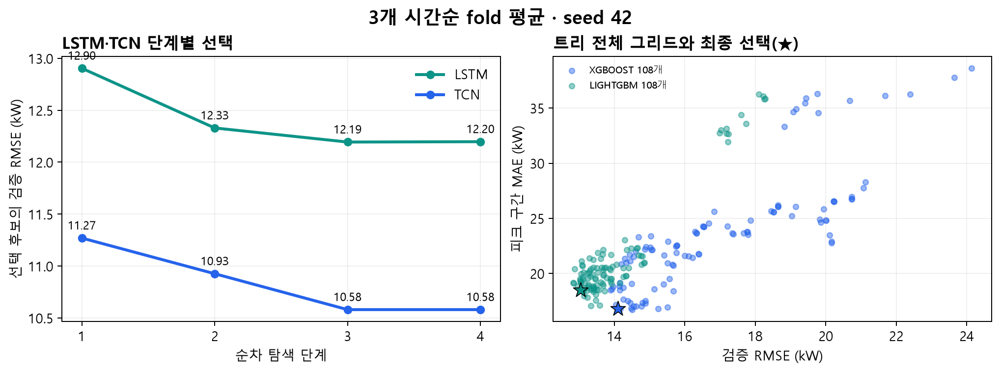

표 2. TCN Grid Search 파라미터 후보값과 최종 선택

| 항목 | 내용 |
|---|---|
| 탐색 방식 | 4단계 순차 탐색 · 각 단계 3개 시간순 fold |
| 입력 길이 | 24 · 48 · 72 · 168시간 |
| 모델 구조 | filters: 32 · 64 · 128 / kernel: 2 · 3 · 5 / dilation: auto · auto+1 |
| 최적화 | learning_rate: 0.0001 · 0.0003 · 0.001 / dropout: 0 · 0.1 · 0.2 · 0.3 |
| 배치 크기 | 16 · 32 · 64 |
| 탐색 규모 | 34개 고유 후보 · 102개 fold 결과 |
| 단계별 RMSE | 11.27 → 10.93 → 10.58 → 10.58 kW |
| 최종 선택 | 24시간 / 128필터 / kernel 2 / auto+1 / lr 0.001 / dropout 0.3 / batch 32 |
| 검증 성능 | RMSE 10.58 kW / 피크 MAE 13.75 kW |

◦ 2.3 트리 모델의 전체 조합 탐색

- XGBoost는 max_depth 3·5·7, 학습률 0.01·0.05·0.1, 트리 수 200·500·1000, min_child_weight 1·5, colsample_bytree 0.8·1.0의 108개 조합을 모두 평가했다. 각 조합에 3개 fold를 적용한 324개 fold 결과와 선택값을 표 3에 정리했다.

- XGBoost 최저 검증 RMSE는 13.89 kW였고 2% 범위에 8개 후보가 남았다. 피크 MAE 16.81 kW인 28번 후보(max_depth 3, 학습률 0.1, 트리 200, min_child_weight 5, 열 표본 1.0)를 선택했다. 선택 후보의 검증 RMSE는 14.10 kW다.

표 3. XGBoost Grid Search 파라미터 후보값과 최종 선택

| 항목 | 내용 |
|---|---|
| 탐색 방식 | 전체 조합 Grid Search · 3개 시간순 fold |
| max_depth | 3 · 5 · 7 |
| learning_rate | 0.01 · 0.05 · 0.1 |
| n_estimators | 200 · 500 · 1000 |
| min_child_weight | 1 · 5 |
| colsample_bytree | 0.8 · 1.0 |
| 탐색 규모 | 108개 후보 · 324개 fold 결과 |
| 선택 규칙 | 최저 RMSE 13.89 kW의 2% 이내 8개 후보 중 피크 MAE 최저 |
| 최종 선택 | depth 3 / lr 0.1 / trees 200 / min_child 5 / colsample 1.0 |
| 검증 성능 | RMSE 14.10 kW / 피크 MAE 16.81 kW |

- LightGBM은 num_leaves 7·15·31, 학습률 0.01·0.05·0.1, 트리 수 200·500·1000, min_child_samples 20·50, colsample_bytree 0.8·1.0의 108개 조합×3 fold를 평가했으며 전체 범위와 선택값은 표 4에 정리했다.

- LightGBM 최저 검증 RMSE는 12.83 kW였고 2% 범위에 13개 후보가 남았다. 피크 MAE 18.49 kW인 55번 후보(잎 15, 학습률 0.05, 트리 500, 최소 자식 표본 50, 열 표본 0.8)를 선택했다. 선택 후보의 검증 RMSE는 13.04 kW다.

표 4. LightGBM Grid Search 파라미터 후보값과 최종 선택

| 항목 | 내용 |
|---|---|
| 탐색 방식 | 전체 조합 Grid Search · 3개 시간순 fold |
| num_leaves | 7 · 15 · 31 |
| learning_rate | 0.01 · 0.05 · 0.1 |
| n_estimators | 200 · 500 · 1000 |
| min_child_samples | 20 · 50 |
| colsample_bytree | 0.8 · 1.0 |
| 탐색 규모 | 108개 후보 · 324개 fold 결과 |
| 선택 규칙 | 최저 RMSE 12.83 kW의 2% 이내 13개 후보 중 피크 MAE 최저 |
| 최종 선택 | leaves 15 / lr 0.05 / trees 500 / min_child 50 / colsample 0.8 |
| 검증 성능 | RMSE 13.04 kW / 피크 MAE 18.49 kW |

◦ 2.4 앙상블과 최종 Test 평가

- 검증 MSE의 역수로 LSTM 0.444, TCN 0.556의 가중치를 정했다. 앙상블 검증 RMSE는 10.50 kW, 검증 경보 F1은 0.663이었다. 검증 잔차 표준편차 10.43 kW를 이용해 177 kW 초과 확률을 계산하고 경보 기준 0.20를 선택했다.

- Test RMSE/F1: LSTM 9.17/0.454, TCN 10.07/0.506, 앙상블 8.67/0.527, XGBoost 11.53/0.481, LightGBM 10.78/0.503. 앙상블이 RMSE와 경보 F1 모두 최고였다.

그림 7. 다섯 후보의 RMSE와 피크 경보 F1

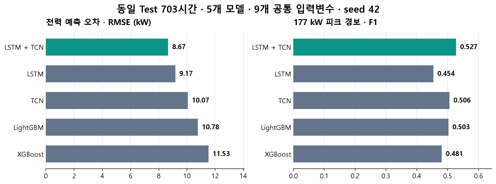

표 5. 동일 Test 703시간의 다섯 모델 성능

| 모델 | RMSE | MAE | 피크 F1 | 재현율 | 미탐지 | 오경보 |
|---|---|---|---|---|---|---|
| LSTM | 9.17 | 6.46 | 0.454 | 100.0% | 0 | 118 |
| TCN | 10.07 | 6.57 | 0.506 | 87.8% | 6 | 78 |
| 가중 앙상블 | 8.67 | 5.90 | 0.527 | 98.0% | 1 | 85 |
| XGBoost | 11.53 | 7.07 | 0.481 | 89.8% | 5 | 90 |
| LightGBM | 10.78 | 6.39 | 0.503 | 95.9% | 2 | 91 |

- Test 피크 49시간의 미탐지/오경보는 LSTM 0/118건, TCN 6/78건, 앙상블 1/85건, XGBoost 5/90건, LightGBM 2/91건이다. 경보 재현율과 오경보 부담을 함께 비교해 최종 후보를 결정했다.

- 앙상블의 Test MAE는 5.90 kW, R²는 0.975, 피크 재현율은 98.0%, 정밀도는 36.1%다. 기준선 대비 RMSE를 30.0% 낮춰 전력 규모와 피크 사전경보를 함께 개선했다.

## 제3장. 영향요인 및 오류분석〔15점〕

◦ 3.1 변수 영향과 공정 해석

- 보존된 트리 모델에서 각 변수의 과거 168시간 묶음을 다섯 번 섞어 Test RMSE 변화를 측정했다. 과거 전력을 섞으면 XGBoost +63.75 kW, LightGBM +62.57 kW로 오차가 크게 늘었다. 공정의 연속 부하가 가장 강한 예측 단서라는 결과다.

- 시간_cos의 RMSE 증가량은 XGBoost +2.48 kW, LightGBM +2.98 kW였고 XGBoost의 생산량은 +1.23 kW였다. 시간 주기와 생산 강도를 함께 확인해야 피크 대응이 정교해진다.

◦ 3.2 생산 강도와 조업 시간의 상호작용

- Test에서 직전 시간 생산량 1,000 이하·오전 07~11시 외 조건의 피크율은 9/433시간(2.1%)이었다. 직전 생산량 1,000 초과와 오전 07~11시가 함께 나타난 조건은 12/42시간(28.6%)이었다. 이 조합을 조업 계획 확인의 우선순위로 삼는다.

그림 8. 변수 묶음 중요도와 생산량·조업 시간의 교차 분석

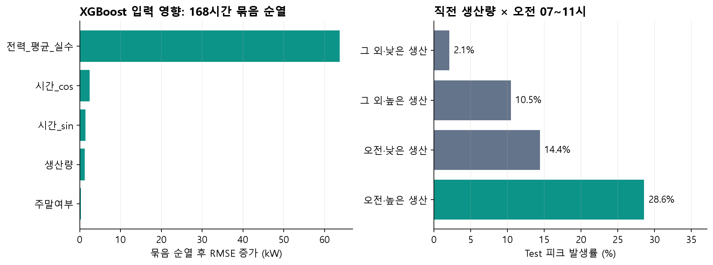

- 생산량과 시간의 결합은 개별 변수만 볼 때보다 운전 상황을 더 구체적으로 설명한다. 해당 교차 집계는 발생 조건의 연관성을 나타내며, 현장 조치는 작업 계획과 설비 상태 확인을 거쳐 결정한다.

◦ 3.3 미탐지와 오경보의 집중 조건

- 최종 Test 피크 49시간에서 앙상블은 48시간을 경보하고 1시간을 놓쳤다. 미탐지 시각은 2021-08-23 15:00:00, 실측 179.5 kW, 예측 167.9 kW, 피크 확률 0.192이었다. 확률이 검증 기준 0.20 바로 아래에 있었고 직전 생산량은 4,563이었다.

그림 10. 피크 집중 기간의 실측·예측·경보

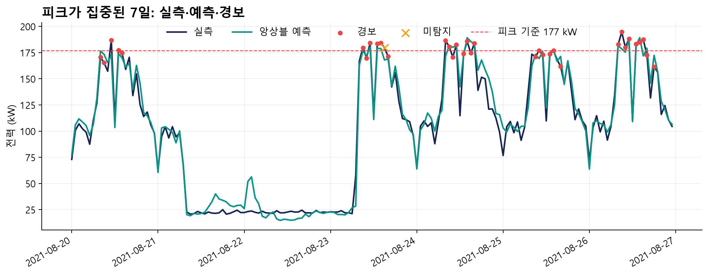

- Test 오경보는 85건이다. 시간대별로 09시·11시·13시에 각각 13건, 16시에 12건이 모였다. 경보 이후 최근 계측값과 생산계획을 함께 확인하는 절차가 필요한 구간이다.

그림 9. 시간대별 오경보 및 미탐지 집중 구간

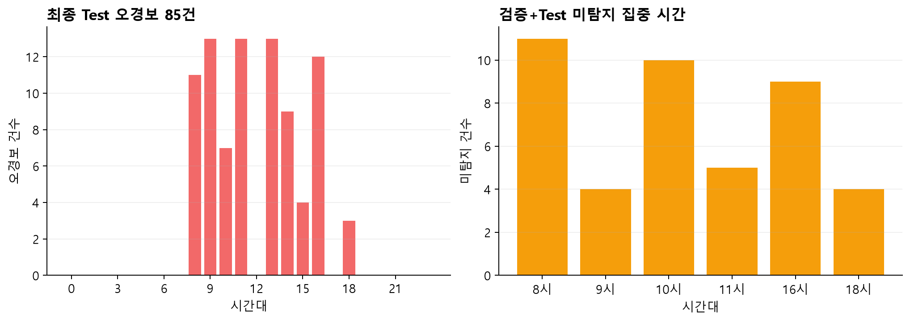

- 검증 2,208시간과 Test 703시간을 합친 오류 진단표에서는 피크 225시간 중 미탐지 57건, 오경보 151건이었다. 미탐지는 08시 11건·10시 10건·16시 9건에, 오경보는 13시 29건·09시 25건에 집중됐다. 이 시간대를 우선 모니터링 대상으로 정했다.

## 제4장. 현장 활용방안〔10점〕

◦ 4.1 현장 의사결정 흐름

- 시간별 전력·생산·기상 데이터를 정제한 후 대시보드에 예상 전력, 177 kW 피크 확률, 관리상한(UCL)과 관리하한(LCL)을 함께 표시한다. 관리한계에는 Test 정보를 쓰지 않고 검증 구간 앙상블 잔차에서 구한 σ=10.43 kW를 고정해 적용한다.

- 시각 t의 관리상한은 예측값(t)+3σ, 관리하한은 max(0, 예측값(t)−3σ)로 계산한다. 현재 관리폭은 예측값 중심으로 ±31.28 kW이다. 정상 오차가 근사적으로 정규분포를 따른다면 약 99.7%가 이 구간에 들어오므로, 일시적 잡음보다 의미 있는 이탈을 선별하는 기준이 된다.

- 실측이 UCL을 넘으면 예상보다 큰 부하 급증으로 보고, LCL 아래면 비정상 설비 정지·계측 오류·생산계획 변경 가능성을 점검한다. 관리한 내부에서도 177 kW 초과 확률이 0.20 이상이면 수요 피크 경보를 별도로 유지해, 공정 이상 감지와 최대수요 관리를 서로 보완한다.

- UCL 이탈 시에는 ① 최근 계측값과 센서 상태 확인, ② 당시 생산량·작업 지시 대조, ③ 부하가 큰 작업의 시작 시점 분산, ④ 품질·안전에 영향이 없는 비필수 설비의 가동 시간 조정 순으로 대응한다. 연속 2회 이상 이탈은 단발성 경보보다 높은 우선순위로 확인한다.

◦ 4.2 조치 우선순위와 운영 기록

- 오전 조업 시작과 직전 시간 생산량 1,000 초과가 겹치는 시각을 우선 확인한다. 오경보가 잦은 09·11·13시에는 예측값만으로 설비를 조정하기보다 작업 계획 및 현장 계측 확인을 함께 수행한다. 생산 안전과 품질 조건을 만족하는 조정안만 작업자가 승인한다.

- 대시보드는 실측·앙상블 예측·3σ 음영·UCL/LCL·3σ 이탈·피크 경보를 한 시간축에 표시하고 5개 후보의 Test 오차를 한 화면에 비교한다. 담당자는 이탈 시각, 상·하한 구분, 원인 확인, 조치, 정상화 시각을 기록해 다음 점검 때 경보 타당성을 되짚는다.

그림 11. 3σ 관리상·하한과 이탈을 표시한 Dash 대시보드

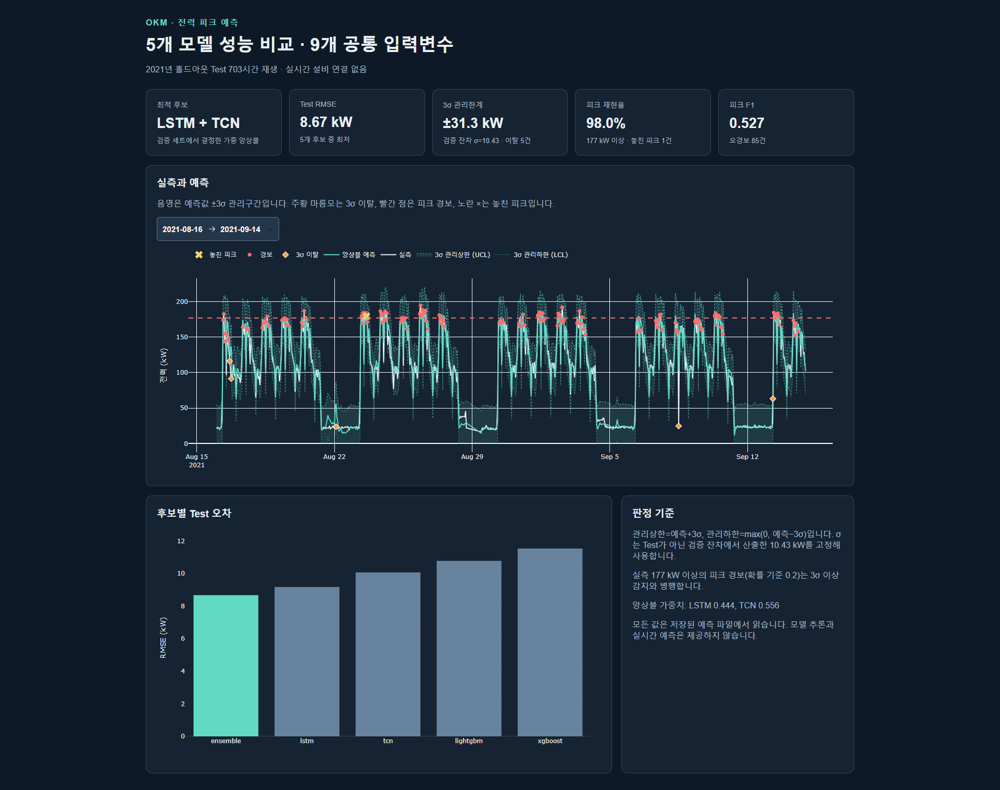

- 평가 구간에서 앙상블은 피크 49시간 중 48시간을 포착하고 전주 같은 시각 기준선 대비 RMSE를 30.0% 낮췄다. 현장 실증에서는 피크 재현율, 불필요 확인 건수, 작업 변경 횟수, 실제 최대수요 전력 변화를 함께 관리한다.

## □ 제5장. 창의성 및 차별성〔10점〕

◦ 5.1 제조공정 특성을 반영한 결합 방식

- 시계열의 장기 패턴을 보는 LSTM(168시간)과 단기 변화를 보는 TCN(24시간)을 검증 오차의 역수로 결합했다. 두 관점의 가중 평균은 LSTM 단독보다 Test RMSE를 0.50 kW, TCN 단독보다 1.39 kW 낮췄다.

- 셧다운 표기와 시간 복원 이력을 전처리 단계에 남겨 공정 중단·재가동을 구분했고, 직전 생산량과 오전 조업 시간의 교차 조건을 사전 점검 대상으로 연결했다. 이는 모델 예측을 실제 작업 순서에 맞추는 설계다.

◦ 5.2 희소 피크에 맞춘 선택과 불확실성 표현

- Test 피크율 7.0%에서 전체 평균 오차만 낮추는 대신 검증 RMSE 2% 범위의 후보 중 피크 MAE를 비교했다. 최종 경보는 검증 잔차 표준편차 10.43 kW를 반영한 피크 확률과 F1 기준값 0.20으로 판단한다.

- 최종 앙상블의 Test F1 0.527은 전주 같은 시각 기준선 0.274보다 0.254 높다. 미탐지 1건과 오경보 85건을 함께 공개해 재현율 중심 경보의 운영 비용을 판단할 수 있게 했다.

## □ 제6장. 코드 구성 및 재현성〔10점〕

◦ 6.1 실행 환경과 파일 구성

- data/의 원본·정제 CSV, src/preprocessing.py의 정제 규칙, model_search/의 모델별 탐색 범위, neural/core/의 신경망 구현·평가, scripts/의 학습·비교·보고서 자동화, results/의 모델 결과, docs/report·docs/presentation의 최종 문서를 역할별로 배치했다.

- Python 통합 환경은 루트 requirements.txt 하나에 명시했다. seed 42, 데이터 해시, 9개 공통 입력변수 목록, 피크 기준, 5개 모델의 후보 선택 규칙은 결과 manifest에 기록했다.

◦ 6.2 전처리부터 제출물 생성까지

- 정제 검증 스크립트는 원본 6,168행에서 정제 결과를 다시 만들고 제공 CSV의 모든 열과 비교한다. 트리 모델 학습 스크립트는 XGBoost와 LightGBM의 108개 조합×3 fold 결과와 선택 모델을 생성한다.

- 5개 모델 비교 검증 스크립트는 Test 시각·실측값 일치와 트리 전체 탐색 완료를 검사한다. 이어서 근거 생성, 변수 중요도, EDA, 도표, HWPX 생성·검증 순으로 실행한다. 대시보드 캡처 스크립트는 실제 Dash 화면을 촬영해 보고서 그림으로 저장한다.

- 표 6은 목적별 실행 명령과 입력·산출물을 한 흐름으로 정리한다. python scripts/reproduce_submission.py는 정제 검증, 결과 비교, 근거표·시각화·HWPX 생성과 검증을 연속 실행한다. --train-trees는 두 트리의 탐색·재학습을, --capture-dashboard는 실제 화면 캡처 갱신을 포함한다. 후보 설정, fold 결과 CSV, Test 예측, 모델 파일을 함께 보관해 선택 과정을 추적할 수 있다.

표 6. 전처리부터 제출물까지의 실행 명령·입력·산출물

| 단계 | 실행 명령 | 입력 | 주요 산출물 |
|---|---|---|---|
| 환경 설치 | python -m pip install -r requirements.txt | requirements.txt | 통합 실행 환경 |
| 전처리 검증 | python scripts/verify_cleaned_data.py | data/*.csv | 6,168행·22열 검증 |
| 트리 학습 | python scripts/train_tree_models.py --models lightgbm xgboost --n-jobs 8 | data/·model_search/ | results/tree_models/ |
| 5개 모델 비교 | python scripts/build_model_comparison.py | neural/results/·results/tree_models/ | results/model_comparison.csv |
| 대시보드 | python dashboard/app.py | 저장된 Test 예측 | 127.0.0.1:8050 |
| 화면 캡처 | python scripts/capture_dashboard.py | Dash 화면 | 03_dashboard.png |
| 제출물 재생성 | python scripts/reproduce_submission.py --capture-dashboard | 전처리·모델 결과 | 근거표·도표·HWPX 검증 |
