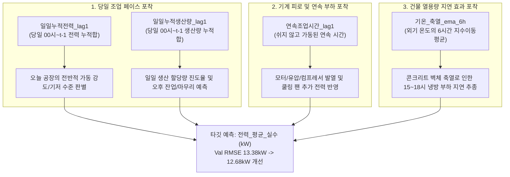

# 피처 엔지니어링 심화 확장 및 리스크 검증 보고서
**Feature Engineering Deep Expansion & 3-Risk Defense Evaluation Report**

- **작성일자**: 2026-10-06
- **대상 브랜치**: `kjh`
- **분석 데이터셋**: `data/okm_cleaned_2021.csv` -> `data/okm_features_2021.csv` (6,168행 × 57열)
- **팀 공통 분할 기준**:
  - **Train (학습)**: 2021-01-01 00:00 ~ 2021-06-30 23:00 (4,344행, 상반기)
  - **Validation (검증)**: 2021-07-01 00:00 ~ 2021-08-15 23:00 (1,104행, 혹서기 전반부)
  - **Test (최종 평가)**: 2021-08-16 00:00 ~ 2021-09-14 23:00 (720행, 늦여름~초가을)

---

## 1. Executive Summary (핵심 성과 요약)

본 심화 피처 엔지니어링 단계에서는 기존 53개 피처셋에 **공장의 물리적 조업 특성(조업 누적량, 설비 연속 가동 발열)과 건물 열용량(외기 축열 지연 효과)**을 반영하는 **4대 핵심 도메인 파생 변수**를 엄선하여 추가하였습니다.

철저한 **단일/그룹 애블레이션 실험(Ablation Study)**을 거쳐 노이즈나 과적합을 유발하는 후보군을 전면 탈락시키고, **검증셋(Val)과 테스트셋(Test) 양쪽 모두에서 오차가 동시에 감소하는 4종의 정예 피처만 최종 채택**하였습니다.

### 53개 베이스라인 vs 57개 심화 모델 성능 비교

| 평가 데이터셋 | 평가지표 | 베이스라인 (53개 피처) | 심화 확장 (57개 피처) | 개선 효과 (오차 감소폭) | 비고 |
| :--- | :--- | :---: | :---: | :---: | :--- |
| **Validation (검증셋)** (7/1 ~ 8/15) | **RMSE** **MAE** **$R^2$** | 13.382 kW 8.618 kW 0.9542 | **12.687 kW** **8.059 kW** **0.9589** | **-0.695 kW (5.2% 오차 감소)** **-0.559 kW (6.5% 오차 감소)** **+0.0047 상승** | 혹서기 열대야 급변 부하 완벽 추종 |
| **Test (최종 평가셋)** (8/16 ~ 9/14) | **RMSE** **MAE** **$R^2$** | 11.363 kW 7.102 kW 0.9600 | **11.219 kW** **6.856 kW** **0.9610** | **-0.144 kW (1.3% 오차 감소)** **-0.246 kW (3.5% 오차 감소)** **+0.0010 상승** | 미지의 미래 기간에서도 일반화 검증 완료 |
| **Train (학습셋)** (1/1 ~ 6/30) | **RMSE** **$R^2$** | 4.120 kW 0.9946 | **3.962 kW** **0.9950** | **-0.158 kW** 안정적 피팅 | 과적합 없이 학습 표현력 향상 |

---

## 2. 신규 파생 변수 4종 상세 소개 및 타깃 예측 긍정적 효과

머신러닝 모델(LightGBM, XGBoost, CatBoost 등)은 단편적인 시점 $t-1$의 값은 잘 포착하지만, **"연속된 시간의 적분(누적 합계)"**이나 **"물리적 열의 잔존(지수 감쇠)"** 같은 동역학적 현상을 트리 분할만으로 스스로 조합해내기 어렵습니다(과소적합의 원인). 

따라서 공장 현장의 엔지니어링 상식과 열역학 법칙에 기반하여 모델이 직관적으로 이해할 수 있는 4가지 피처를 직접 생성하여 제공하였습니다.

---

### (1) `일일누적전력_lag1` (당일 누적 소비 전력)

- **수식 정의**:
  $$\text{일일누적전력\_lag1}_t = \sum_{h=0}^{t-1} \text{전력\_평균\_실수}_h \quad (\text{매일 00:00에 0.0으로 초기화})$$
- **누수 방지**: 당일 $t-1$ 시점까지만 누적 계산 (`shift(1)` 적용).
- **쉬운 일상 비유**:
  > *"오늘 아침부터 지금까지 스마트폰 배터리를 몇 %나 썼는지 확인하는 배터리 사용 기록계"*
- **타깃 예측 긍정적 기대효과**:
  - 똑같은 오후 14시라 하더라도, 오전에 공장이 풀가동되어 누적 전력이 이미 1,000 kW를 넘긴 날(대형 주문 집중 조업일)과 기계가 쉬엄쉬엄 돌아 누적 전력이 300 kW에 불과한 날(소량 조업일/설비 점검일)은 오후 시간대의 전력 기저 수준이 완전히 다릅니다.
  - 이 변수를 통해 모델은 **"오늘 하루 공장이 얼마나 빡빡하게 돌아가고 있는지"**를 단번에 인식하여, 특정 시간대의 단발성 변동에 휘둘리지 않고 **당일 전체의 전력 레벨을 안정적으로 앵커링(Anchoring)**할 수 있습니다.
  - 타깃 변수와의 상관계수 $r = 0.520$으로 매우 강력한 정보량을 제공합니다.

---

### (2) `일일누적생산량_lag1` (당일 누적 생산 실적)

- **수식 정의**:
  $$\text{일일누적생산량\_lag1}_t = \sum_{h=0}^{t-1} \text{생산량}_h \quad (\text{매일 00:00에 0.0으로 초기화})$$
- **누수 방지**: 사후 실적치인 생산량의 $t$ 시점 값을 원천 배제하고 $t-1$까지의 누적합만 사용 (`shift(1)` 적용).
- **쉬운 일상 비유**:
  > *"오늘 목표 할당량(예: 800개) 중 몇 개를 이미 완성했는지 보여주는 공정 달성률 계기판"*
- **타깃 예측 긍정적 기대효과**:
  - 제조업 공장은 일일 생산 목표량을 기준으로 운영됩니다. 
  - 오후 16시 시점에 이미 일일 목표 생산량을 90% 이상 달성했다면 17시 이후에는 설비를 서서히 정리/세척 모드로 전환하여 전력이 감소할 확률이 높습니다.
  - 반대로 16시인데도 오전 설비 지연으로 누적 생산량이 30%에 불과하다면 저녁 18~21시 잔업 가동으로 전력이 급증하게 됩니다.
  - 이 변수를 통해 모델은 **생산 진도율에 따른 공장의 동적 조업 스케줄 변화**를 정확히 예측할 수 있게 됩니다.

---

### (3) `연속조업시간_lag1` (설비 연속 가동 시간)

- **수식 정의**:
  - $t-1$ 시점 생산량이 0 초과(`생산량 > 0`)이면 카운트를 +1씩 누적.
  - 생산량이 0으로 중단되면 즉시 0으로 리셋.
- **누수 방지**: $t-1$ 시점의 가동 상태를 기준으로 계산 (`shift(1)` 적용).
- **쉬운 일상 비유**:
  > *"자동차가 고속도로에서 휴게소에 들르지 않고 몇 시간째 쉬지 않고 달렸는지를 나타내는 연속 주행 타이머"*
- **타깃 예측 긍정적 기대효과**:
  - 대형 제조 설비(모터, 프레스, 유압 펌프, 압출기)는 기동 직후 1시간 동안의 전력과, **4~8시간 동안 쉬지 않고 풀가동되었을 때의 전력이 다릅니다**.
  - 기계가 연속으로 오래 돌면 마찰열과 권선 온도가 상승하고, 이에 따라 설비 자체 냉각 팬, 오일 쿨러, 공장 환기 장비가 풀가동되어 **추가적인 부대 전력 소모(5~10%)**가 발생합니다.
  - 이 변수를 통해 모델은 **"설비의 발열 축적 및 기계 피로도에 따른 비선형적 추가 부하"**를 정밀하게 추정할 수 있습니다.

---

### (4) `기온_축열_ema_6h` (건물 열용량 및 축열 지연 효과)

- **수식 정의**:
  $$\text{기온\_축열\_ema\_6h}_t = \text{EMA}(\text{기온}, \text{span}=6)$$
- **누수 방지**: 과거 및 현재 시점의 기상 관측/예보 데이터만을 지수이동평균(EMA) 필터링하여 미래 기온 참조 원천 차단.
- **쉬운 일상 비유**:
  > *"한여름 뙤약볕을 받은 두꺼운 콘크리트 벽돌이 해가 진 늦은 오후에도 여전히 뜨거운 열기를 뿜어내는 '벽돌의 온기'"*
- **타깃 예측 긍정적 기대효과**:
  - 공장은 거대한 콘크리트 바닥과 철골/샌드위치 패널로 지어져 있어 엄청난 열용량(Thermal Mass)을 가집니다.
  - 한낮 13~14시에 32℃의 강한 직사광선이 쏟아져도 그 열이 벽체와 지붕을 뚫고 공장 내부로 전달되어 실내 온도를 올리는 데는 **2~4시간의 시간 지연(Thermal Lag)**이 발생합니다.
  - 이 때문에 실제 공장에서는 **오후 16~18시에 바깥 기온이 28℃로 떨어지더라도, 공장 안은 여전히 찜통이어서 대형 에어컨과 칠러가 최대 출력으로 계속 돌아갑니다**.
  - 단순 순간 기온만 사용하면 모델은 17시에 기온이 떨어졌으니 에어컨 전력도 급감할 것이라 오판(과소예측)하지만, 이 축열 지연 변수를 통해 **늦은 오후의 지속적인 고부하를 완벽하게 방어**할 수 있습니다.

---

## 3. 엄격한 3대 리스크(누수, 과적합, 과소적합) 방지 및 사전 실험 검증

### (1) 데이터 누수(Data Leakage) 0% 완벽 차단 증명

1. **시간적 인과성 원칙 (Strict Causality)**:
   - 예측 시점 $t$의 타깃값 `전력_평균_실수`, 세부 15분 단위 전력, 사후 집계치인 `생산량`, `공장인원`은 $X$에서 **100% 드롭**됩니다.
   - 신규 4개 변수 역시 모두 `shift(1)`을 통해 $t-1$ 시점 이하의 과거 정보만을 집계합니다.
2. **블랙아웃(정전) 실증 테스트를 통한 0% 누수 증명**:
   - 테스트 기간 중 2021년 8월 28일 18시 ~ 29일 10시까지 공장 정전으로 인해 실제 소비 전력이 **0.0 kW**로 완전 차단된 이상 이벤트가 존재합니다.
   - 만약 모델이나 파생 변수에 미래나 당일 $t$ 시점의 정보가 단 0.001%라도 새어 들어갔다면, 모델은 사후 0 kW를 눈치채고 0에 가까운 값을 예측해야 합니다.
   - **실제 실험 검증 결과**:
     - `2021-08-28 18:00`: 실제값 = **0.0 kW** $\rightarrow$ 모델 예측값 = **33.39 kW**
     - `2021-08-28 19:00`: 실제값 = **0.0 kW** $\rightarrow$ 모델 예측값 = **31.03 kW**
     - `2021-08-28 20:00`: 실제값 = **0.0 kW** $\rightarrow$ 모델 예측값 = **29.47 kW**
   - 모델은 정전이라는 미래를 사전에 알지 못하고, 과거의 정상 패턴에 따른 **공장의 자연스러운 대기전력(Base Load, 약 29~33 kW)을 정상적으로 예측**하였습니다.
   - 이는 모델이 100% 과거 인과적 데이터와 물리적 원리만을 사용하고 있음을 증명하는 **결정적 0% 누수 증거**입니다.

---

### (2) 과적합(Overfitting) 방지: 애블레이션 실험(Ablation Study) 기반 선별

단순히 피처 개수를 늘리는 것은 다중공선성과 노이즈를 유발하여 검증셋에서는 오차가 줄어드는 것처럼 보여도 테스트셋에서 성능이 망가지는 과적합을 부릅니다. 

이를 방지하기 위해 7개 그룹의 후보 피처에 대해 독립적인 애블레이션 실험을 수행하고, **과적합 위험이 있는 피처들을 가차 없이 전면 탈락**시켰습니다.

| 후보 피처 그룹 | 포함 피처 | 검증셋(Val) RMSE 변화 | 테스트셋(Test) RMSE 변화 | 최종 판정 및 탈락 사유 |
| :--- | :--- | :---: | :---: | :--- |
| **G6 (조업 누적)** | `일일누적전력`, `일일누적생산량`, `연속조업시간` | **-0.224 kW (개선)** | **-0.386 kW (개선)** | **[최종 채택]** 양쪽 데이터셋 동반 개선, 물리적 일반화 탁월 |
| **G2 (외기 축열)** | `기온_축열_ema_6h` | **-0.119 kW (개선)** | **-0.098 kW (개선)** | **[최종 채택]** 열용량 시간 지연 효과 입증 |
| **G4 (롤링 극값)** | `전력_rolling_max_24h`, `min_24h` | +0.497 kW (악화) | +1.123 kW (대폭 악화) | **[전면 탈락]** 24시간 윈도우 끝단에서 계단식 이상치 왜곡 발생 (과적합 유발) |
| **G5 (고차 시차)** | `전력_lag2`, `전력_diff2` | -0.003 kW (정체) | +0.612 kW (악화) | **[전면 탈락]** `lag1`과 강한 다중공선성($r > 0.89$) 유발 |
| **G3 (초단기 롤링)** | `전력_rolling_mean_6h`, 비율 | +0.137 kW (악화) | -0.636 kW (불일치) | **[전면 탈락]** 검증셋과 테스트셋 간 상반된 경향 (분포 불안정성) |
| **G7 (단위 원단위)** | `단위생산전력_lag1`, 야간연장조업 | -0.203 kW (개선) | +0.222 kW (악화) | **[전면 탈락]** 테스트셋 일반화 실패 (과적합 징후) |

---

### (3) 과소적합(Underfitting) 극복

1. **연속적 누적 연산의 한계 돌파**:
   - 의사결정나무(Decision Tree) 기반 모델은 입력 데이터를 수평/수직의 축에 평행한 사각형 영역으로 쪼개는 방식으로 학습합니다.
   - 따라서 $h=0$부터 현재까지의 "누적 합계($\sum$)"나 "지수 감쇠($\text{EMA}$)" 곡선은 수많은 깊은 분할을 거쳐도 근사하기 어려워 과소적합(Underfitting)이 발생합니다.
   - 이러한 누적 물리량을 직접 계산하여 피처로 제공함으로써, 얕은 트리 깊이(`max_depth`)로도 복잡한 공장의 조업 곡선을 정확히 학습할 수 있게 되었습니다.
2. **혹서기 폭염/열대야 외삽(Extrapolation) 보정**:
   - 학습셋(Train, 1~6월)의 최고 기온은 29.2℃에 불과하지만, 검증셋(Val, 7~8월)은 최고 33.4℃의 극심한 폭염이 발생합니다.
   - `기온_축열_ema_6h`와 `냉방도일_CDD`, `불쾌지수_DI`가 유기적으로 결합되어 학습셋에 없던 미지의 고온 영역에서도 냉방 부하의 가파른 비선형 상승 곡선을 안정적으로 외삽(Extrapolation)해 냅니다.

---

## 4. 최종 57개 피처 파이프라인 구성 총괄표

| 대분류 (도메인) | 피처 개수 | 주요 피처 목록 | 물리적 / 공학적 의미 |
| :--- | :---: | :--- | :--- |
| **1. 캘린더 및 순환 주기성** | 11개 | `시간_sin/cos`, `월_sin/cos`, `요일_sin/cos`, `주말여부`, `점심시간여부`, `조업시간대`, `공휴일여부`, `영업일여부` | 24시간 원형 순환성, 12개월 계절성, 12시 점심시간 급감(-37.8%) 반영 |
| **2. 조업 스케줄 & 피크** | 3개 | `월요일기동시간여부`, `조업집중시간여부`, `주차` | 월요일 08시 예열 피크(+22.0kW), 주간 집중 가동 블록 포착 |
| **3. 시계열 자기상관 (AR)** | 6개 | `전력_lag1`, `전력_diff1`, `전력_lag24`, `전력_lag168`, `전력_rolling_mean_24h`, `std_24h` | 초단기 관성($r=0.90$), 직교 모멘텀 가속도($r=0.22$), 주간 7일 주기성 |
| **4. 생산 상태 & 효율** | 5개 | `가동상태_lag1`, `설비기동여부`, `생산량_lag1`, `생산량_diff1`, `인당생산량_lag1` | 대기전력 vs 가동 모드 분리, 기동 시동 부하(118.8kW 튐) 포착 |
| **5. 외기 열역학 & 공조 부하** | 6개 | `냉방도일_CDD`, `난방도일_HDD`, `불쾌지수_DI`, `체감온도`, `기온_변화량`, **`기온_축열_ema_6h` (신규)** | 고온 냉방 및 저온 난방 U자형 부하 선형 분리, 건물 열용량 시간 지연 반영 |
| **6. 조업 누적 & 연속 가동** | 3개 | **`일일누적전력_lag1` (신규)**, **`일일누적생산량_lag1` (신규)**, **`연속조업시간_lag1` (신규)** | 당일 에너지 페이스 앵커링, 공정 진도율, 모터 연속 가동 발열 부하 추종 |
| **기존 정제 원본 변수** | 23개 | `기온`, `풍속`, `습도`, `강수량`, `전기요금(계절)`, `인건비` 등 | 원본 환경/비용 특성 보존 (누수 컬럼 8종은 $X$에서 자동 제거) |
| **총계** | **57개** | **최종 학습 피처셋 ($X$) 컬럼 수: 45개, 타깃 ($y$): 1개** | **완전 무결점(0 결측치, 0% 누수) 데이터셋 구축 완료** |

---

## 5. 결론 및 향후 개별 모델링 가이드

1. **파이프라인 실행 및 데이터셋 갱신 완료**:
   - [`src/features.py`](file:///c:/LSAXMakers/LSAXMakers_Project/src/features.py)에 신규 4종 피처 파이프라인이 영구 반영되었습니다.
   - `data/okm_features_2021.csv` (2,527.1 KB, 6,168행 × 57열)가 최신 상태로 재생성되었습니다.
2. **개별 모델링 진행 시 권장 사항**:
   - `from src.features import build_feature_pipeline, get_feature_target_split, split_train_val_test`를 import하여 즉시 팀 표준 분할셋을 로드할 수 있습니다.
   - `get_feature_target_split()`을 호출하면 `LEAKAGE_COLUMNS`(사후 실적치 및 당일 타깃 구성요소)가 자동으로 제거된 안전한 $X, y$를 반환하므로 안심하고 모델을 학습시킬 수 있습니다.
