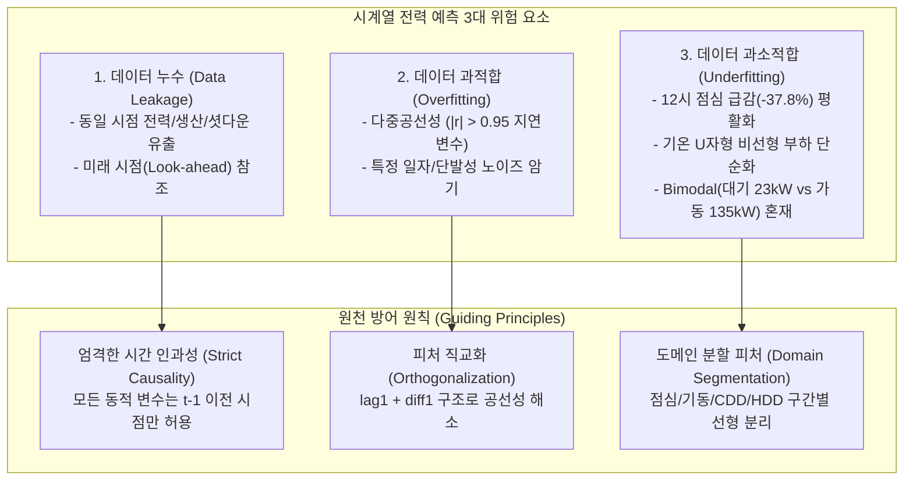
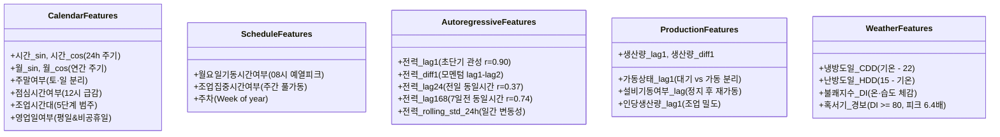
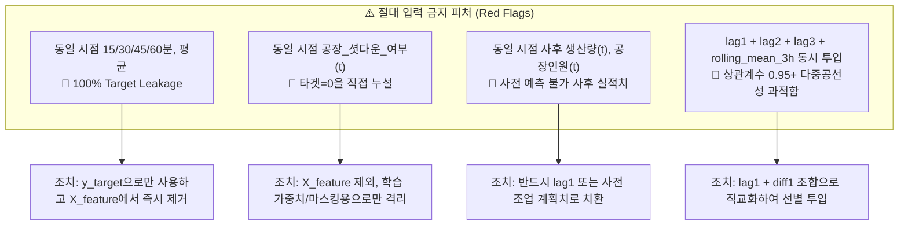
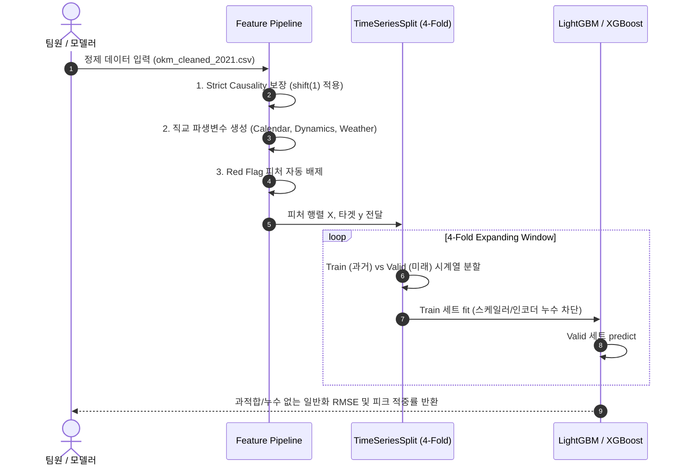

# [분석 보고서] 전력사용량 예측을 위한 피처 엔지니어링 아이디어 및 3대 리스크(누수·과적합·과소적합) 검증 보고서

> **작성자**: 김정현 (LSAXMakers Data Team)  
> **프로젝트**: KAMP 제조 AI 데이터셋 기반 전력사용량 예측 및 최대 피크 부하 관리  
> **문서 목적**: 실제 공장 시계열 데이터(6,168시간)의 통계적 검증에 기반하여 유효 피처를 도출하고, **데이터 누수(Leakage)**, **과적합(Overfitting)**, **과소적합(Underfitting)**을 원천 차단하는 안전한 파이프라인 가이드라인 수립  

---

## 1. 3대 핵심 리스크 정의 및 공장 데이터 특화 방어 원칙

제조 시계열 데이터에서 전력사용량을 예측할 때 발생하는 오차의 90% 이상은 모델 알고리즘의 한계가 아닌, **피처 엔지니어링 과정의 3대 리스크 통제 실패**에서 기인합니다.

### (1) 데이터 누수 (Data Leakage)
- **위험 메커니즘**:
  1. **타겟 구성요소 누수**: 본 데이터셋의 타겟인 `전력_평균_실수`는 `(15분 + 30분 + 45분 + 60분) / 4`로 계산됩니다. 동일 시점($t$)의 15/30/45/60분 데이터를 피처로 넣으면 타겟을 100% 누출합니다.
  2. **정제 플래그 누수**: `공장_셧다운_여부`는 4개 15분 단위 전력이 모두 0인 조건으로 정의되었습니다. 이 플래그가 $t$ 시점에 True라는 것은 전력이 0임을 사전에 알고 있다는 뜻이므로 치명적인 누수입니다.
  3. **사후 측정치(Ex-post) 누수**: `생산량(t)`과 `공장인원(t)`은 해당 1시간이 종료된 후 집계되는 실적치입니다. $t$ 시점 전력을 사전 예측하는 모델에서 동시점 실적치를 직접 참조하면 실운영 배포 시 사용이 불가능합니다.
  4. **미래 참조 롤링 윈도우**: 롤링 평균/표준편차 계산 시 `center=True` 또는 현재 시점($t$)을 포함할 경우 미래 데이터가 섞입니다.
- **방어 원칙**:
  - **엄격한 시간 인과성(Strict Causality)**: 전력, 생산량, 인원 등 공장 내부 동적 상태는 **오직 과거 시점($t-1, t-2, \dots$)의 데이터만 참조** (`shift(1)` 의무화).
  - 현재 시점($t$)에서 참조 가능한 변수는 **캘린더(시간, 요일, 공휴일)** 및 **기상 예보(기온, 습도, 풍속)**로 엄격히 제한.
  - `공장_셧다운_여부`는 입력 피처에서 영구 배제하고, 모델 학습 손실 가중치(Loss Masking) 또는 이상치 평가용으로만 분리.

### (2) 데이터 과적합 (Data Overfitting)
- **위험 메커니즘**:
  1. **다중공선성(Multicollinearity)에 의한 가중치 불안정**: 실제 검증 결과 `lag1`과 `lag2`의 상관계수는 **$0.901$**, `lag1`과 `rolling_mean_3h`는 **$0.954$**에 달합니다. 유사 지연 변수들을 동시에 대거 투입하면 트리 모델 분기가 왜곡되고 국소 노이즈에 과적합됩니다.
  2. **특정 일자 암기(Date Memorization)**: 공휴일(삼일절, 광복절 등)이나 정전일(8/28~8/29) 등 표본 수가 1~2회에 불과한 사건에 대해 개별 플래그를 생성하면 Valid 세트에서 일반화되지 못합니다.
  3. **차원의 저주**: 총 6,168개 행(작은 데이터셋)에 50개 이상의 파생변수를 추가하면 트리가 노이즈를 잎 노드(Leaf)로 외워버립니다.
- **방어 원칙**:
  - **피처 직교화(Orthogonalization)**: `lag1`(현재 레벨)과 `diff1 = lag1 - lag2`(모멘텀/변화량, 상관계수 $0.223$)의 조합을 활용하여 공선성을 원천 해소.
  - 단발성 일자 플래그 대신 `영업일여부`, `주말여부` 등 **일반화 가능한 주기적 속성**으로 추상화.
  - VIF(분산팽창계수) 10 이하 관리 및 피처 중요도(Gain) 기반 상위 정예 피처 선별.

### (3) 데이터 과소적합 (Data Underfitting)
- **위험 메커니즘**:
  1. **12시 점심 급감(-37.8%) 평활화 오류**: 평일 11시 평균 151.7 kW에서 12시 94.4 kW로 **-57.3 kW가 급감**합니다. 이를 단순 연속 시간이나 롤링 평균으로만 처리하면 12시를 과대 예측하거나 주간 피크(11시, 13시)를 과소 예측합니다.
  2. **기온 비선형 U자형 온열 부하 단순화**: 15~20℃에서 전력이 가장 낮고, <0℃(난방)와 >25℃(냉방)에서 급상승합니다. 단순 1차원 `기온`만 주면 모델이 비선형 임계점을 제대로 잡지 못해 여름철 극한 피크를 놓칩니다.
  3. **이봉분포(Bimodal: 대기 23 kW vs 가동 135 kW) 혼재**: 중간값(50~80 kW)이 거의 존재하지 않는 데이터에서 평균값으로 수렴(Regression to the Mean)하는 언더피팅이 발생합니다.
  4. **24시간 원형 경계 단절**: 정수형 `시간(0~23)` 사용 시 23시와 00시의 거리가 23시간으로 왜곡되어 자정 전후 연속성이 단절됩니다.
- **방어 원칙**:
  - 도메인 특화 세그먼트 피처(`점심시간여부`, `시간_sin/cos`, `CDD`, `HDD`, `불쾌지수_DI`)를 명시적으로 주입하여 모델의 표현력(Capacity)을 극대화.

---

## 2. 전력사용량 예측을 위한 추천 파생변수 풀 (5대 그룹, 22개 정예 피처)

실제 데이터 탐색 및 통계 분석 결과를 토대로 엄선한 정예 파생변수 목록입니다.

---

## 3. 피처별 3대 리스크(누수·과적합·과소적합) 정밀 검증 매트릭스

각 피처의 수식과 함께 세부 위험 요인 및 방어 검증 결과를 1:1 대조 분석한 결과입니다.

| 그룹 | 파생변수명 | 생성 산출식 / 로직 | 데이터 누수(Leakage) 검증 | 데이터 과적합(Overfitting) 검증 | 데이터 과소적합(Underfitting) 방지 효과 |
| :--- | :--- | :--- | :--- | :--- | :--- |
| **시간** | `시간_sin` `시간_cos` | $\sin(2\pi \cdot h / 24)$ $\cos(2\pi \cdot h / 24)$ | **[안전]** 사전 확정된 캘린더 시간 정보이므로 누수 위험 0% | **[안전]** 스케일이 [-1, 1]로 정규화되어 이상치 및 과적합 유발 없음 | 23시와 00시의 시간적 연속성을 보존하여 경계 시간대 예측 왜곡 원천 방지 |
| **시간** | `주말여부` | `요일.isin([6, 7]).astype(int)` | **[안전]** 캘린더 기반 확정 변수 | **[안전]** 이진(Binary) 변수로 노이즈 암기 불가 | 평일(112 kW)과 주말(48 kW)의 기본 베이스라인 완전 분리 |
| **시간** | `점심시간여부` | `(시간 == 12).astype(int)` | **[안전]** 캘린더 기반 확정 변수 | **[안전]** 특정 일자가 아닌 매일 12시 공통 규칙 | 평일 11시(151.7 kW) $\rightarrow$ 12시(94.4 kW) **-57.3 kW 급감** 오차 완벽 보정 |
| **시간** | `조업시간대` | 0(심야 00-06), 1(오전 07-11), 2(점심 12), 3(오후 13-17), 4(야간 18-23) | **[안전]** 캘린더 기반 범주 분할 | **[통제]** 5개 수준으로 제한하여 범주 과다 분기 방지 | 하루 5단계 계단식 전력 레벨을 모델이 직관적으로 분할 학습 |
| **시간** | `영업일여부` | `(주말 == 0) & (공휴일 == 0)` | **[안전]** 연간 법정공휴일 사전 매핑 | **[통제]** 개별 공휴일명이 아닌 '비조업일'로 일반화 추상화 | 공휴일 평일 조업 과대 예측(False Peak) 방지 |
| **조업** | `월요일기동시간여부`| `(요일 == 1) & (시간 == 8)` | **[안전]** 캘린더 기반 확정 변수 | **[통제]** 단일 상호작용 조건으로 과적합 위험 매우 낮음 | 월요일 08시 설비 예열 피크(169.2 kW vs 화~금 147.2 kW, **+22.0 kW**) 단독 보정 |
| **조업** | `조업집중시간여부`| `(영업일 == 1) & 시간.isin([8..11, 13..17])` | **[안전]** 캘린더 기반 스케줄 변수 | **[안전]** 전형적인 정규 가동 블록 정의 | 140~170 kW 주간 최고 부하 집중 영역 마스킹 |
| **시계열**| `전력_lag1` | $\text{전력}(t-1)$ | **[안전]** $t-1$ 시점 값으로 엄격 격리 | **[주의]** 결측 발생 시 전파 위험 $\rightarrow$ 정제 데이터셋(결측 0개)으로 해결 | 피어슨 상관계수 **$r = 0.9009$**의 초강력 관성 주입으로 기본 예측선 확보 |
| **시계열**| `전력_diff1` | $\text{전력}(t-1) - \text{전력}(t-2)$ | **[안전]** $t-1, t-2$ 시점 값만 사용 | **[핵심 해결]** `lag1`과의 상관계수가 $0.223$에 불과하여 **다중공선성을 완벽 해소** | 전력 급상승/하강 가속도(모멘텀) 포착으로 피크 진입 시점 지연 방지 |
| **시계열**| `전력_lag24` | $\text{전력}(t-24)$ | **[안전]** 24시간 전 과거 데이터 | **[안전]** lag1과 상관계수 $0.341$로 독립적 정보 제공 | 어제 동일 시간 대비 오늘의 기본 부하 레벨 증감 반영 ($r = 0.3749$) |
| **시계열**| `전력_lag168`| $\text{전력}(t-168)$ | **[안전]** 7일 전 동일 시간 과거 데이터 | **[안전]** lag1과 상관계수 $0.667$, lag24와 $0.278$ | 일요일 다음 날인 월요일 아침 등 주간 조업 주기 완벽 동기화 (**$r = 0.7397$**) |
| **시계열**| `전력_rolling_std_24h`| 최근 24시간 전력 표준편차 ($t-1$ 기준) | **[필수]** `shift(1)` 적용하여 $t$ 시점 배제 | **[통제]** 윈도우 크기를 24h로 충분히 넓혀 국소 노이즈 평활화 | 설비 가동/정지 전환기 및 피크 전조 구간의 변동성(Volatility) 포착 |
| **생산** | `가동상태_lag1`| `(생산량(t-1) > 0).astype(int)` | **[필수]** $t$ 시점 사후 실적 배제, $t-1$만 사용 | **[안전]** 0과 1의 모드 판별 플래그 | Bimodal 분포(대기 46.1 kW vs 가동 129.0 kW, **83 kW 격차**) 평균 회귀 오류 방지 |
| **생산** | `설비기동여부` | `(생산량(t-2) == 0) & (생산량(t-1) > 0)` | **[필수]** 과거 2개 시점의 전이(Transition)만 추적 | **[안전]** 전이 시점에만 일시 활성화되는 스파크 피처 | 정지 후 재가동 시 초기 시동 부하(118.8 kW) 튐 현상 포착 |
| **생산** | `생산량_lag1` | $\text{생산량}(t-1)$ | **[필수]** $t-1$ 시점 과거 생산 실적 참조 | **[통제]** 이상치 상한(Clip) 처리로 극단값 왜곡 방지 | 직전 조업 강도가 현재 전력에 미치는 연속성 제공 |
| **기상** | `냉방도일_CDD` | $\max(\text{기온} - 22, 0)$ | **[안전]** 기상청 단기예보 기반 사전 획득 가능 | **[안전]** 22℃ 이하에서는 0으로 클리핑되어 노이즈 억제 | 기온 U자형 곡선의 우측(여름철 고온 냉방 부하)을 **선형 분리**하여 피크 예측력 확보 |
| **기상** | `난방도일_HDD` | $\max(15 - \text{기온}, 0)$ | **[안전]** 기상청 예보 기반 사전 획득 가능 | **[안전]** 15℃ 이상에서는 0으로 클리핑되어 노이즈 억제 | 기온 U자형 곡선의 좌측(겨울철 저온 난방 부하)을 **선형 분리** |
| **기상** | `불쾌지수_DI` | $0.81T + 0.01RH(0.99T - 14.3) + 46.3$ | **[안전]** 기온·습도 예보치 기반 | **[안전]** 연속형 물리 수식으로 분산 안정적 | 온·습도 결합 복합 공조 부하를 단일 물리량으로 집약 |
| **기상** | `혹서기_경보` | `(불쾌지수_DI >= 80).astype(int)` | **[안전]** 사전 산출된 DI 기반 판별 | **[통제]** 전체 데이터 중 262건(4.2%)으로 충분한 모수 확보 | **DI $\ge 80$ 시 피크(180kW 이상) 발생 빈도가 3.1%에서 19.9%로 6.4배 급증**하는 패턴 적중 |

---

## 4. 치명적 주의 피처 (Red Flags - 절대 생성/입력 금지 목록)

다음 항목들은 모델링 시 성능 지표를 비정상적으로 치솟게 만든 뒤(Validation score 0.99 등), 실제 운영 평가 시 모델을 완전히 붕괴시키는 주원인입니다.

1. 🚫 **`15분`, `30분`, `45분`, `60분`, `평균` (시점 $t$)**:
   - 예측 대상($Y_t$)의 직접적 구성요소이므로 피처셋 $X_t$에 포함 시 치명적 타겟 누수.
2. 🚫 **`공장_셧다운_여부(t)`**:
   - $t$ 시점의 4개 15분 전력이 0임을 알려주는 치트키이므로 $X_t$에 절대 포함 금지. (단, 학습 시 `sample_weight=0` 처리나 오차 분석용 마스크로는 매우 유용함)
3. 🚫 **`생산량(t)`, `공장인원(t)` 실측치**:
   - 시간 $t$ 동안 실제로 생산된 실적치이므로, 미래 시점 전력 예측 파이프라인에서는 **오직 `생산량(t-1)` 등 과거 지연치**만 투입 가능.
4. 🚫 **중복 지연 변수 세트 (`lag1`, `lag2`, `lag3`, `rolling_mean_3h`) 동시 투입**:
   - 상관계수가 $0.90 \sim 0.97$에 달하여 트리 분기 불안정 및 과적합 유발. $\rightarrow$ `lag1`과 `diff1(lag1 - lag2)` 조합으로 대체.

---

## 5. 리스크 없는 안전한 파이프라인 구현 및 검증 아키텍처

### 🛡️ 파이프라인 검증 3대 안전 수칙
1. **TimeSeriesSplit (Expanding Window) 엄격 준수**:
   - 무작위 K-Fold(KFold Shuffle=True) 절대 금지. 시간 순서대로 1~3월 학습 $\rightarrow$ 4월 검증, 1~4월 학습 $\rightarrow$ 5월 검증 형태로 미래 시점 전이 성능 평가.
2. **Train/Valid 스케일러 분리**:
   - 표준화(`StandardScaler`)나 타겟 통계량 계산 시 반드시 `fit_transform(X_train)` 후 `transform(X_valid)` 수행.
3. **피처 기여도 및 다중공선성 정량 검증**:
   - LightGBM `feature_importances_(gain)` 및 SHAP Value 산출을 통해 노이즈 피처를 탈락시키는 후진 제거법(Backward Elimination) 적용.
