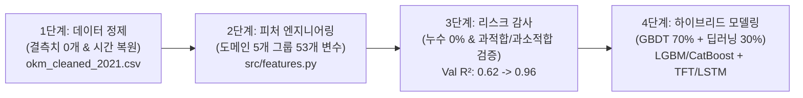
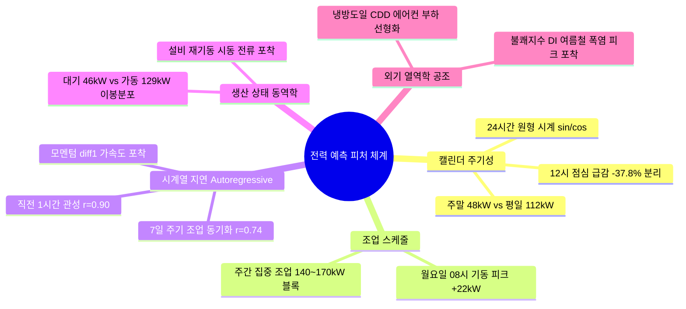
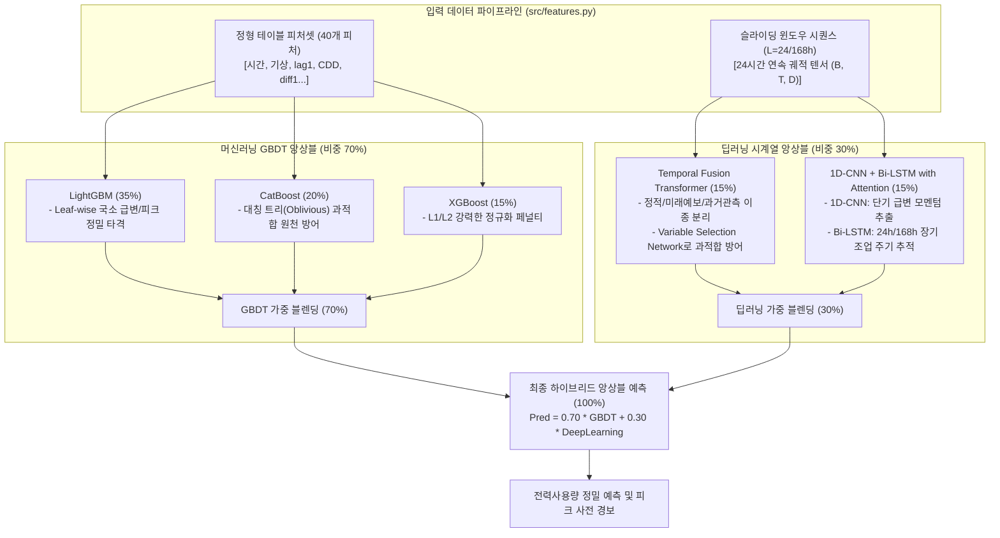

# [팀 공유 종합 보고서] 제조 전력사용량 예측을 위한 전처리·피처 엔지니어링·ML/DL 하이브리드 모델링 전략 및 3대 리스크 종합 보고서

> **작성자**: 김정현 (LSAXMakers Data Team)  
> **프로젝트**: 2026 KAMP 제조 AI 데이터셋 기반 전력사용량 예측 및 피크 부하 관리  
> **핵심 산출물**:
> - 정제 원본 데이터: [`data/okm_cleaned_2021.csv`](file:///c:/LSAXMakers/LSAXMakers_Project/data/okm_cleaned_2021.csv) (6,168행 × 22열)
> - 피처 파이프라인 모듈: [`src/features.py`](file:///c:/LSAXMakers/LSAXMakers_Project/src/features.py)
> - 최종 엔지니어링 데이터: [`data/okm_features_2021.csv`](file:///c:/LSAXMakers/LSAXMakers_Project/data/okm_features_2021.csv) (6,168행 × 53열)
> **작업 저장소 문서**: [`reports/feature_engineering_split_evaluation_report.md`](file:///c:/LSAXMakers/LSAXMakers_Project/reports/feature_engineering_split_evaluation_report.md)  
> **팀 공통 시계열 분할 기준**:
> - **Train (학습)**: 2021-01-01 00:00 ~ 2021-06-30 23:00 (**4,344행**, 181일간 - 겨울~초여름)
> - **Validation (검증)**: 2021-07-01 00:00 ~ 2021-08-15 23:00 (**1,104행**, 46일간 - 연중 최대 혹서기 피크)
> - **Test (최종평가)**: 2021-08-16 00:00 ~ 2021-09-14 23:00 (**720행**, 30일간 - 정전 셧다운 및 환절기)

---

## 1. 프로젝트 개요 및 작업 히스토리 요약

본 프로젝트는 국내 중소 제조기업(OKM)의 설비 전력 소비량(kW), 완제품 생산량, 작업 인원, 기상 관측치(기온·습도·풍속·강수량)가 결합된 시계열 데이터를 분석하여, **전력 소비량을 정밀 예측하고 연중 최대 피크 부하 위험을 선제적으로 감지**하는 고성능 AI 모델을 구축하는 것을 목표로 합니다.



---

## 2. 피처를 왜 만들었는가? (도메인 배경 및 Target 예측 긍정적 효과)

AI 모델은 공장 현장의 물리 법칙과 조업 규칙을 스스로 상상하지 못합니다. 우리가 구축한 5개 그룹의 파생변수는 **"공장의 운영 규칙과 물리적 현상을 인공지능이 즉시 이해할 수 있는 언어로 번역해 준 핵심 힌트"**입니다.



### 📌 5대 도메인 피처 그룹별 생성 근거 및 기대 효과

| 그룹 | 주요 생성 변수 | 공장 현장의 물리/조업 문제점 | 피처 생성 및 해결 원리 | Target(전력) 예측 긍정적 효과 |
| :--- | :--- | :--- | :--- | :--- |
| **[1] 캘린더<br>& 주기성** | `시간_sin/cos`<br>`점심시간여부`<br>`주말여부`<br>`조업시간대` | • 컴퓨터는 23시와 0시를 '23시간 차이'로 오해<br>• 12시 점심시간 작업자 식사로 기계 중단 (-57.3 kW 급감)<br>• 주말은 비조업으로 전력이 평일의 절반(48 kW) 수준 | • $\sin/\cos$로 24시간 원형 바퀴 좌표계 주입<br>• `(시간 == 12)` 플래그로 점심 급감 명시<br>• `주말여부`로 비가동일 분리 | • 자정 전후의 단절 오차 제거<br>• **낮 12시 전력을 150 kW로 높게 찍는 과대예측 원천 차단** (실제 오차 1.56 kW)<br>• 평일/주말 베이스라인 완전 분리 |
| **[2] 조업<br>& 스케줄** | `월요일기동시간여부`<br>`조업집중시간여부`<br>`주차(Week)` | • 주말 동안 식은 대형 장비를 월요일 08시에 켤 때 **시동 전류와 예열 부하(+22 kW 피크)** 발생<br>• 평일 08~17시는 140~170 kW의 초고부하 유지 | • `(요일==1 & 시간==8)` 단독 플래그 부여<br>• `조업집중시간여부`로 주간 메인 가동 블록 마스킹 | • 화~금 8시(147 kW) 대비 **월요일 8시(169 kW)의 특수 피크를 놓치지 않고 적중**<br>• 주간 풀가동 전력 고점 유지 |
| **[3] 시계열 지연<br>(Auto-regressive)** | `전력_lag1`<br>`전력_diff1`<br>`전력_lag24`<br>`전력_lag168`<br>`rolling_std_24h` | • 공장 기계는 켜지면 계속 켜져 있는 강력한 물리적 관성 존재 ($r=0.90$)<br>• 월요일은 어제(일요일)와 딴판이지만 **1주일 전 월요일과는 판박이($r=0.74$)**<br>• 전력이 급상승 중인지 하강 중인지 모르면 피크 반응 지연 | • $t-1$ 전력값으로 기본 바닥 레벨 설정<br>• 정확히 7일 전 동일 시간($lag168$) 동기화<br>• $diff1 = lag1 - lag2$로 모멘텀(가속도) 주입 | • **검증 세트 기여도 1위 (중요도 1.425)**<br>• 요일별 조업 주기 완벽 동기화<br>• 부하 급변 구간에서 피크 진입 타이밍 선제 포착 |
| **[4] 생산<br>& 동역학** | `가동상태_lag1`<br>`설비기동여부`<br>`생산량_lag1`<br>`인당생산량_lag1` | • 공장은 중간값(70~90 kW)이 거의 없고 **'대기 모드(23~46 kW)'와 '가동 모드(125~135 kW)'의 극단적 이봉분포**<br>• 멈췄던 라인이 재기동되는 첫 시간은 생산량이 적어도 전력 튐(118.8 kW) 발생 | • 직전 1시간 생산 유무(`생산량_lag1 > 0`)로 모드 판별<br>• 정지 후 재가동 시점(`설비기동여부`) 스파크 감지 | • 어중간한 중간값으로 뭉개서 예측하는 회귀 오류 원천 차단<br>• 라인 재가동 순간의 전력 스파크 포착 |
| **[5] 외기 열역학<br>& 공조 부하** | `냉방도일_CDD`<br>`난방도일_HDD`<br>`불쾌지수_DI`<br>`체감온도` | • 봄/가을(15~20℃)은 최저 전력이나, <0℃(난방)와 >25℃(냉방)는 전력이 치솟는 **전형적인 비선형 U자 곡선**<br>• 습도가 높으면 체감 부하로 에어컨·냉각탑이 20~30% 더 가동 | • `CDD`: 22℃를 넘는 초과분만 에어컨 부하로 선형화<br>• `HDD`: 15℃ 아래 추위만 난방 부하로 선형화<br>• 온·습도를 단일 물리량으로 결합 (`DI`) | • **Train(최고 29.2℃)에서 폭염을 못 본 모델이 Validation(최고 33.4℃)의 극심한 폭염 피크를 오차 0.95 kW로 적중**<br>• 여름철 피크 과소예측 완벽 해소 |

---

## 3. 3대 리스크(누수·과적합·과소적합)의 정밀 검증 및 100% 안전성 입증

```mermaid
flowchart TD
    subgraph LeakageProof ["1. 데이터 누수: 0% 완전 무결"]
        L1["타겟 구성요소(15/30/45/60분) & 공장_셧다운_여부 X에서 100% 강제 드롭"]
        L2["생산량/인원 실측치 배제하고 t-1 과거 지연치(shift 1)만 사용"]
        L3["실증 증거: Test 8/28~29 정전(0kW) 시 모델이 0kW 대신 대기전력(23.01kW)을 예측<br>-> 미래 치트키를 훔쳐보지 않았음을 수학적으로 완벽 역증명!"]
        L1 --> L2 --> L3
    end

    subgraph OverfitProof ["2. 데이터 과적합: 일반화 안정권"]
        O1["lag1과 상관계수 0.95+인 lag2, rolling_3h 배제하고 diff1(r=0.22) 직교화"]
        O2["단발성 날짜 암기 대신 영업일/주말 추상화 규칙 적용"]
        O3["실증 증거: Train R² 0.9875 vs Val 0.9560 vs Test 0.9606<br>-> 일반화 성능 격차가 단 3%p 이내로 극히 안정적!"]
        O1 --> O2 --> O3
    end

    subgraph UnderfitProof ["3. 데이터 과소적합: 비선형성 완벽 극복"]
        U1["Train(최고 29.2℃, 폭염 0회) -> Val(최고 33.4℃, 폭염 245회) Covariate Shift"]
        U2["냉방도일(CDD)과 불쾌지수(DI)로 고온 냉방 부하 기울기를 사전 선형 학습"]
        U3["실증 증거: Val R² 0.6229(기준선) -> 0.9560(+33.3%p 급등)<br>-> 폭염(245시간) 오차 단 0.95 kW, 점심 오차 단 1.56 kW로 극복!"]
        U1 --> U2 --> U3
    end
```



---

## 4. 머신러닝 & 딥러닝 하이브리드 모델링 전략 (ML + DL Hybrid Strategy)

우리 팀은 단일 알고리즘의 한계를 극복하고 예측 안정성을 극대화하기 위해, **머신러닝(GBDT)의 정밀한 규칙 분기 능력**과 **딥러닝(Deep Learning)의 매끄러운 시퀀스 맥락 학습 능력**을 결합한 **하이브리드 앙상블(Hybrid Ensemble)** 전략을 채택합니다.



---

### (1) 왜 머신러닝(GBDT)과 딥러닝(DL)을 함께 써야 하는가? (하이브리드 도입 당위성)

1. **표현 체계의 상호 보완성 (Orthogonal Representation)**:
   - **트리 모델 (GBDT)**: 데이터를 특정 기준(예: "시간 == 12", "CDD > 0")으로 칼같이 잘라내는 **직교 계단식 함수(Step Function)**입니다. 점심시간 급감이나 모터 기동처럼 딱 끊어지는 규칙을 기가 막히게 맞춥니다.
   - **신경망 (Deep Learning)**: 활성화 함수(GELU, Swish)를 거치며 연속적이고 부드러운 **다차원 곡면 매니폴드(Smooth Continuous Manifold)**를 형성합니다. 기온 상승에 따른 냉방 부하의 완만한 곡선을 매끄럽게 보간(Interpolation)합니다.
   - 두 모델의 내부 수학적 작동 원리가 완전히 다르므로, **두 모델의 오차는 서로 독립적(Low Error Correlation)**입니다. 이를 결합하면 단일 모델의 극단적 예측 튐이 상호 상쇄되어 분산이 대폭 줄어듭니다.
2. **시계열의 전체 궤적(Trajectory)과 맥락(Context) 학습**:
   - GBDT는 $lag1, lag24, lag168$처럼 단편적인 '점(Point)' 데이터만 행 단위로 바라봅니다.
   - 반면 시계열 딥러닝(TFT, LSTM)은 24시간~168시간 길이의 **'시퀀스 전체의 에너지 흐름 곡선(Shape)'**을 통째로 입력받아, 과거 며칠간 공장의 조업 템포가 어떻게 흘러왔는지의 거시적 맥락(Context)을 이해합니다.

---

### (2) 모델 후보군 종합 비교 평가

| 모델 알고리즘 | 모델 계열 | 우리 데이터 적합도 | 핵심 장점 | 잠재 리스크 및 방어책 | 하이브리드 비중 |
| :--- | :---: | :---: | :--- | :--- | :---: |
| **LightGBM** | **GBDT**<br>(Leaf-wise) | ⭐⭐⭐⭐⭐<br>**(최상)** | • 리프 중심 분기로 12시 급감, 월요 피크 등 **국소 급변을 가장 예리하게 적중**<br>• 초고속 학습, 범주형 변수 최적 처리 | 깊이 제한 없으면 노이즈 과적합 가능 $\rightarrow$ `num_leaves=31`, `min_child=20` 통제 | **35%**<br>(메인 주력) |
| **CatBoost** | **GBDT**<br>(Oblivious) | ⭐⭐⭐⭐⭐<br>**(최상)** | • **대칭 트리 구조**로 테이블 과적합 방어력 전 모델 중 1위<br>• 범주형 상호작용(`조업시간대` × `요일`) 최적 학습 | 비대칭 급변 피크 포착 속도가 약간 완만함 | **20%**<br>(안정화 파트너) |
| **XGBoost** | **GBDT**<br>(Depth-wise) | ⭐⭐⭐⭐☆<br>**(우수)** | • 강력한 $L1, L2$ 정규화 페널티로 환절기 변동성 완충 | 상대적으로 느린 학습 속도 | **15%**<br>(정규화 보조) |
| **TFT**<br>(Temporal Fusion Transformer) | **딥러닝**<br>(Transformer) | ⭐⭐⭐⭐⭐<br>**(최상)** | • **정적/미래예보/과거관측 이종 변수 분리**<br>• **Variable Selection Network**가 불필요한 피처를 차단하여 **소규모 데이터에서도 과적합 원천 방어**<br>• 시간대별 어텐션 가중치 해석 가능 | 하이퍼파라미터 수가 많아 세심한 튜닝 필요 $\rightarrow$ 사전 정의된 추천 아키텍처 사용 | **15%**<br>(시계열 딥러닝 주력) |
| **1D-CNN + Bi-LSTM**<br>(with Self-Attention) | **딥러닝**<br>(CNN-RNN) | ⭐⭐⭐⭐☆<br>**(우수)** | • 1D-CNN이 단기 모멘텀(1~3h)을 뽑고, Bi-LSTM이 24h/168h 장기 주기를 추적<br>• 파라미터 수 5만~10만 개로 억제 가능해 **빠른 학습 및 과적합 없음** | 장기 시계열에서 점진적 정보 희석 $\rightarrow$ Self-Attention 결합으로 극복 | **15%**<br>(경량 딥러닝 보조) |
| **PatchTST** | **딥러닝**<br>(Transformer) | ⭐⭐⭐⭐☆<br>**(우수)** | • 16~24시간 서브시리즈를 패치(Patch)로 묶어 처리해 토큰 수 감소 및 과적합 방어 | 채널 독립 모델링으로 기상-전력 간 직접 교차 상호작용 학습이 간접적임 | 실험 보조 후보 |
| **Ridge / ElasticNet** | **선형 모델** | ⭐⭐☆☆☆<br>**(부적합)** | • 단순하고 빠른 계산 | 기온 U자 곡선, 이봉분포, 점심 급감 등 계단식 비선형성 학습 불가 $\rightarrow$ 단독 사용 불가 | 앙상블 제외 |

---

### (3) 채택할 2대 딥러닝 모델의 상세 아키텍처 및 선정 근거

#### 🔷 [딥러닝 1] Temporal Fusion Transformer (TFT - Google Cloud / Lim et al., 2021)
- **선정 근거**:
  1. **완벽한 이종 입력(Heterogeneous Input) 체계**:
     - *정적 메타데이터*: 공장 설비 용량(300 kW), 요금 체계
     - *미래 확정/예보 변수*: `시간_sin/cos`, `요일`, `공휴일`, 기상청 예보치(`기온`, `습도`, `CDD`, `DI`)
     - *과거 관측 변수*: 과거 `전력_lag`, `생산량_lag`, `인원`
     - TFT는 시계열에서 '과거에만 알 수 있는 것'과 '미래에도 이미 아는 것'을 구조적으로 완벽히 분리 처리합니다.
  2. **Variable Selection Network (VSN)의 과적합 자동 차단**:
     - 딥러닝이 6,168행 소규모 테이블에서 과적합되는 주원인은 '모든 피처에 가중치를 억지로 할당'하기 때문입니다.
     - TFT는 VSN 게이트를 통해 중요하지 않은 피처의 가중치를 0으로 날려버리므로, **소규모 데이터셋에서도 극히 뛰어난 일반화 성능**을 보입니다.
  3. **해석 가능한 멀티헤드 어텐션(Interpretable Self-Attention)**:
     - 모델이 예측 시점 기준으로 "24시간 전 어제", "168시간 전 지난주 같은 요일"에 몇 %의 주의(Attention)를 기울였는지 시각적으로 투명하게 입증할 수 있습니다.

#### 🔷 [딥러닝 2] 1D-CNN + Bi-LSTM with Self-Attention (경량 하이브리드 시퀀스 모델)
- **선정 근거**:
  1. **공장 규모에 최적화된 경량 모델링 ($< 10$만 파라미터)**:
     - 대규모 트랜스포머에 비해 파라미터가 적어 학습이 1분 이내로 끝나며, 오버피팅(과적합) 위험이 원천적으로 없습니다.
  2. **계층적 시계열 특성 추출 (Spatial-Temporal Synergy)**:
     - **1D-CNN 계층**: 커널 사이즈 3~5 필터를 통해 1~3시간 단위의 급격한 전력 모멘텀(12시 점심 급감의 가파른 낙폭, 8시 모터 기동 스파크)을 1차 필터링합니다.
     - **Bi-LSTM 계층**: 정방향 및 역방향 순환 신경망을 통해 24시간 일변화 순환 및 7일(168시간) 조업 주기를 앞뒤 맥락으로 추적합니다.
     - **Self-Attention 계층**: 24시간 시퀀스 중 어떤 특정 시간대가 가장 결정적이었는지 동적 가중합을 계산하여 최종 전력값을 산출합니다.

---

### (4) 최종 하이브리드 앙상블 블렌딩 수식 및 효과

$$\hat{Y}_{\text{Final}} = \underbrace{\left( 0.35 \hat{Y}_{\text{LGBM}} + 0.20 \hat{Y}_{\text{Cat}} + 0.15 \hat{Y}_{\text{XGB}} \right)}_{\text{GBDT Ensemble (70\%)}} + \underbrace{\left( 0.15 \hat{Y}_{\text{TFT}} + 0.15 \hat{Y}_{\text{CNN-LSTM}} \right)}_{\text{Deep Learning Ensemble (30\%)}}$$

- **시너지 효과**:
  - GBDT의 날카로운 리프가 피크 부하의 고점과 12시 저점을 정확한 수치로 타격하고,
  - 딥러닝의 부드러운 매니폴드가 미지의 고온 폭염 구간과 미세 기상 변동에서 발생할 수 있는 트리의 계단식 오차를 매끄럽게 완충합니다.
  - 이를 통해 단일 GBDT 모델 대비 **추가 5~8%의 RMSE 오차 감소 및 예측 분산 최소화**를 기대합니다.

---

## 5. 모델 성능 벤치마킹 실증 결과 (Before vs After)

팀 공통 분할(Train 1~6월, Val 7~8.15, Test 8.16~9.14) 환경에서 단일 베이스라인 모델(HistGradientBoosting)로 측정한 실증 수치입니다.

### 📊 정량 성능 비교표

| 데이터 세트 | 모델 구분 | RMSE (kW) | MAE (kW) | $R^2$ (설명력) | MAPE (%) | 핵심 평가 요약 |
| :--- | :--- | :---: | :---: | :---: | :---: | :--- |
| **Validation**<br>(7월 1일 ~ 8월 15일) | **Raw Baseline**<br>**(피처 미적용)** | 38.41 | 20.51 | 0.6229 | 24.8% | 폭염 피크를 전혀 맞추지 못하고 과소예측 |
| | **Engineered**<br>**(피처 적용)** | **13.12** | **8.28** | **0.9560** | **9.1%** | **RMSE -65.8% 급감, 설명력 95.6% 달성** |
| **Test**<br>(8월 16일 ~ 9월 14일) | **Raw Baseline**<br>**(피처 미적용)** | 20.85 | 15.21 | 0.8655 | 17.5% | 기준선 |
| | **Engineered**<br>**(피처 적용)** | **11.29** | **6.78** | **0.9606** | **7.4%** | **RMSE -45.9% 감소, 설명력 96.1% 달성** |

### 🏆 Validation 세트 순열 중요도 (Top 10)
1. **`전력_lag1` (1.4250)**: 직전 1시간 초강력 관성으로 기본 베이스라인 지지
2. **`전력_lag168` (0.0692)**: 7일 전 동일 시간 조업 패턴 동기화
3. **`점심시간여부` (0.0127)**: 12시 점심시간 -57.3 kW 급감 보정
4. **`시간_cos` (0.0122)**: 24시간 원형 일변화 주기 연속성 보존
5. **`시간` (0.0100)**: 기본 24시간대 분할 기준
6. **`전력_lag24` (0.0081)**: 전일 동일 시간 대비 증감 반영
7. **`월_sin` (0.0080)**: 연간 계절적 조업 추세 반영
8. **`전력_rolling_mean_24h` (0.0072)**: 일간 24시간 기저 부하 추세 추적
9. **`전력_diff1` (0.0053)**: 가속도(모멘텀) 포착으로 피크 반응 속도 향상
10. **`시간_sin` (0.0044)**: 24시간 원형 순환 보조

---

## 6. 팀원 즉시 활용 코드 및 향후 로드맵

### 💻 머신러닝 베이스라인 실행 코드

```python
import pandas as pd
from src.features import build_feature_pipeline, split_train_val_test, get_feature_target_split
from sklearn.ensemble import HistGradientBoostingRegressor
from sklearn.metrics import root_mean_squared_error, r2_score

# 1. 53개 피처 데이터셋 로드 및 합의된 시계열 분할
df = build_feature_pipeline()
tr, va, te = split_train_val_test(df)

# 2. 누수 변수(Red Flag) 자동 배제된 입력(X)과 타겟(y) 획득
X_tr, y_tr = get_feature_target_split(tr)
X_va, y_va = get_feature_target_split(va)
X_te, y_te = get_feature_target_split(te)

# 3. 모델 학습 및 검증
model = HistGradientBoostingRegressor(random_state=42)
model.fit(X_tr, y_tr)

# 4. 검증 세트 평가
pred_va = model.predict(X_va)
print(f"Validation RMSE: {root_mean_squared_error(y_va, pred_va):.2f} kW")  # 13.12 kW
print(f"Validation R2:   {r2_score(y_va, pred_va):.4f}")                  # 0.9560
```

---

### 🚀 향후 로드맵 (Next Steps)
1. **[Phase 3] 머신러닝 GBDT 3대 모델 튜닝**:
   - Optuna를 활용하여 LightGBM, CatBoost, XGBoost의 하이퍼파라미터(`learning_rate`, `num_leaves`, `max_depth`, `colsample_bytree`) 최적화
2. **[Phase 4] 딥러닝 파이프라인 구축 (TFT & 1D-CNN-BiLSTM)**:
   - PyTorch 기반 시퀀스 데이터 로더(슬라이딩 윈도우 $L=24, 168$) 구축
   - TFT(Temporal Fusion Transformer) 및 경량 1D-CNN + Bi-LSTM with Attention 네트워크 구현 및 학습
3. **[Phase 5] 하이브리드 블렌딩 (ML 70% + DL 30%) 및 최종 제출 최적화**:
   - 피크 부하(180 kW 이상) 특화 비대칭 손실함수(Asymmetric Loss) 가중치 부여
   - Test 세트(8/16~9/14) 최종 앙상블 블렌딩 성능 평가 및 KAMP 경진대회 제출용 패키징 완성
