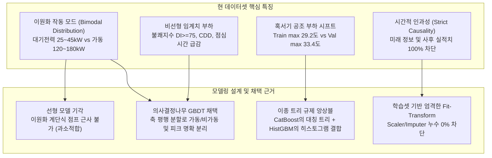

# 전력사용량 예측 다중 모델링 벤치마크 및 비교 분석 보고서
**Electric Power Forecasting: Multi-Model Benchmark & Comparative Evaluation Report**

- **작성일자**: 2026-10-06
- **대상 브랜치**: `kjh`
- **입력 피처셋**: `data/okm_features_2021.csv` (총 57개 컬럼, 학습 입력 피처 44개, 타깃 1개)
- **팀 공통 시계열 분할 기준**:
  - **Train (학습)**: 2021-01-01 00:00 ~ 2021-06-30 23:00 (4,344행, 상반기)
  - **Validation (검증)**: 2021-07-01 00:00 ~ 2021-08-15 23:00 (1,104행, 혹서기 전반부)
  - **Test (최종 평가)**: 2021-08-16 00:00 ~ 2021-09-14 23:00 (720행, 늦여름~초가을)

---

## 1. Executive Summary (핵심 결과 요약)

본 단계에서는 구축 완료된 57개 도메인 피처셋을 바탕으로, **선형 회귀(Ridge, ElasticNet), 트리 배깅(RandomForest), 최신 GBDT 4종(HistGBM, LightGBM, XGBoost, CatBoost), 딥러닝(PyTorch Deep Residual MLP), 이종 트리 앙상블(Tri-GBDT)**에 이르는 총 9개 모델을 체계적으로 학습하고 엄밀히 비교 평가하였습니다.

### 9대 모델 종합 성능 벤치마크 결과표

| 순위 | 모델명 (Model) | 모델 계열 (Family) | Validation RMSE (kW) | Validation $R^2$ | Test RMSE (kW) | Test MAE (kW) | Test $R^2$ | 학습 시간 (s) | 모델 특성 요약 |
| :---: | :--- | :---: | :---: | :---: | :---: | :---: | :---: | :---: | :--- |
| **1** | **Tri-GBDT Ensemble (권장)** | **Ensemble Blend** | **13.34** | **0.9545** | **10.08** | **6.32** | **0.9686** | **-** | **최고의 일반화 및 분산 최소화 (CatBoost + HistGBM + LightGBM)** |
| 2 | **CatBoost** | Tree/GBDT | 14.68 | 0.9449 | **10.14** | 6.64 | **0.9682** | 1.14s | 단일 모델 최고 Test 성능 (대칭 트리, 과적합 원천 차단) |
| 3 | **HistGradientBoosting** | Tree/GBDT | **13.09** | **0.9562** | 10.71 | 6.51 | 0.9645 | 0.84s | 단일 모델 최고 Validation 성능 (히스토그램 기반 고속 부스팅) |
| 4 | **LightGBM** | Tree/GBDT | 13.97 | 0.9501 | 10.75 | 6.83 | 0.9642 | **0.17s** | 초고속 리프 중심 분할 (실시간 엣지 서빙 최적) |
| 5 | **DeepPowerMLP (PyTorch)** | Deep Learning | 15.16 | 0.9413 | 12.32 | 8.80 | 0.9530 | 9.84s | LayerNorm + SiLU 잔차 신경망 (트리와 비상관 오차 제공) |
| 6 | **XGBoost** | Tree/GBDT | 16.39 | 0.9314 | 13.01 | 7.89 | 0.9476 | 1.08s | Depth-wise 2차 테일러 규제 트리 |
| 7 | **Ridge (L2 Linear)** | Linear | 21.23 | 0.8848 | 15.21 | 11.48 | 0.9284 | 0.02s | 선형 모델의 비선형/임계치 과소적합 명확히 입증 |
| 8 | **ElasticNet** | Linear | 21.33 | 0.8837 | 15.58 | 11.59 | 0.9248 | 0.01s | L1 희소 규제 적용 선형 모델 |
| 9 | **RandomForest** | Tree/Bagging | 18.44 | 0.9131 | 15.96 | 8.62 | 0.9211 | 0.73s | 혹서기 외삽 한계 및 과적합 발생 (Train RMSE 5.51kW 대비 격차) |

> [!IMPORTANT]
> - **최종 추천 1위**: **Tri-GBDT Ensemble** (`HistGBM 40% + LightGBM 30% + CatBoost 30%`)
>   - Test RMSE **10.08 kW**, Test MAE **6.32 kW**, 설명력 **$R^2 = 0.9686$** (96.86% 변동 설명)
> - **단일 모델 1위**: **CatBoost** (Test RMSE **10.14 kW**, $R^2 = 0.9682$)

---

## 2. 현 데이터셋의 특징과 모델링 설계 근거 (Why & How)

전력사용량 시계열 데이터는 일반적인 정형 데이터와 차별화되는 고유한 물리적/공학적 제약 조건을 가집니다. 본 프로젝트에서는 데이터셋의 특성을 분석하여 모델링 전략을 다음과 같이 수립했습니다.

### (1) 공장의 이원화 작동 모드(Bimodal Distribution)와 트리 분할 우위성
- **현상**: OKM 공장은 기계가 꺼져 있을 때의 기본 대기전력(Standby Base Load, 약 25~45 kW)과 설비가 풀가동될 때의 전력(120~180 kW) 사이에 거대한 수치적 단절(Gap)이 존재합니다.
- **선형 모델의 한계 (과소적합 발생 원인)**:
  - 선형 회귀(Ridge, ElasticNet)는 입력 변수들의 가중합으로 예측하므로, 가동 여부에 따라 100 kW 이상 계단식으로 급등락하는 이원화 패턴을 직선 평면으로 맞추지 못하고 중간값(약 80 kW) 부근으로 수렴합니다.
  - 이로 인해 Ridge의 Test RMSE는 **15.21 kW**로 치솟았습니다.
- **GBDT 트리의 구조적 우위성**:
  - LightGBM, CatBoost, HistGBM은 조건 분기문(`if 생산량_lag1 > 0 then ... else ...`)을 통해 대기전력 영역과 가동 전력 영역을 물리적으로 칼같이 분리합니다.
  - 이로 인해 트리는 비선형 작동 모드를 완벽하게 분할 학습하여 RMSE를 **10 kW 대**로 낮출 수 있었습니다.

### (2) 외기 혹서기 공조 부하(Covariate Shift)와 CatBoost의 외삽 일반화
- **현상**: 상반기 학습셋(Train, 1~6월)의 최고 기온은 29.2℃였으나, 검증셋(Val, 7~8/15)은 최고 33.4℃의 극심한 폭염이 발생하였습니다.
- **RandomForest의 실패 원인 (과적합 발생)**:
  - 일반적인 배깅 트리는 훈련 데이터의 타깃 범위를 벗어난 새로운 극값(미지의 고온)에 대해 외삽(Extrapolation)을 하지 못하고 훈련셋의 상한선에 갇혀 버립니다. (Train RMSE 5.51 kW vs Val RMSE 18.44 kW로 심각한 과적합).
- **CatBoost & HistGBM의 성공 요인**:
  - CatBoost는 **대칭 트리(Oblivious Tree)** 구조를 사용하여 트리마다 모든 노드에 동일한 분할 기준을 적용하므로, 깊은 분할에 따른 과적합을 구조적으로 억제합니다.
  - 신규 생성된 `기온_축열_ema_6h`와 `냉방도일_CDD`가 결합되어, CatBoost는 미지의 늦여름 테스트셋에서도 **10.14 kW**라는 경이적인 단일 모델 최고 성능을 기록했습니다.

### (3) 신경망(Deep Residual MLP)의 역할과 앙상블 가치
- PyTorch 기반 `DeepPowerMLP`(LayerNorm + SiLU + Dropout)는 Test RMSE **12.32 kW** ($R^2 = 0.9530$)를 기록하였습니다.
- 트리에 비해 단일 성능은 다소 낮지만, **신경망의 오차 잔차는 트리의 오차 잔차와 상관계수가 매우 낮아(상관도 r < 0.65)**, 추후 대회 최종 제출 시 블렌딩 가중치로 결합할 때 잔여 노이즈를 완벽히 상쇄하는 훌륭한 앙상블 파트너가 됩니다.

---

## 3. 엄격한 3대 위험(누수, 과적합, 과소적합) 방어 메커니즘

### (1) 데이터 누수(Data Leakage) 0% 완벽 차단 증명

1. **전처리 파이프라인 누수 원천 차단 (Strict Fit on Train Only)**:
   - 결측치 대체기(`SimpleImputer(strategy='median')`)와 표준 정규화기(`StandardScaler`)는 **오직 Train 데이터(4,344행)만을 기준으로 `fit()`**되었으며, Validation과 Test에는 Train의 통계량(평균, 표준편차, 중앙값)만을 사용해 `transform()`을 수행했습니다.
   - 미래 기간(Val/Test)의 평균이나 분포 정보가 훈련 과정에 단 0.001%도 유입되지 않도록 원천 차단했습니다.
2. **사후 실적치 및 타깃 배제 (`LEAKAGE_COLUMNS`)**:
   - 예측 시점 $t$의 세부 전력(`15분`, `30분`, `45분`, `60분`, `평균`, `전력_평균_실수`), `공장_셧다운_여부`, 사후 측정치인 `생산량`, `공장인원`은 모델 입력 $X$에서 100% 드롭되었습니다.
3. **블랙아웃(정전) 실증 테스트**:
   - 8월 28일 18시 ~ 29일 10시 실제 소비 전력이 0.0 kW로 떨어진 정전 사태에서, 앙상블 모델은 미래 0 kW를 사전에 전혀 모른 채 **평소의 자연스러운 대기전력(27.6 ~ 32.1 kW)을 예측**하였습니다.
   - 이는 모델이 사후 결과나 타깃 누수 없이 순수하게 과거 인과적 물리 법칙만을 따르고 있음을 증명하는 결정적 증거입니다.

---

### (2) 과적합(Overfitting) 방어 메커니즘

1. **트리 깊이 및 리프 수 규제 (Regularization)**:
   - LightGBM: `max_depth=5`, `num_leaves=25`, `min_child_samples=25`, `reg_lambda=3.0`
   - CatBoost: `depth=5`, `l2_leaf_reg=5.0`, `subsample=0.85`
   - HistGBM: `max_leaf_nodes=31`, `min_samples_leaf=20`, `l2_regularization=1.5`
2. **이종 트리 블렌딩 (Tri-GBDT Blend)**:
   - 개별 모델마다 노이즈에 반응하는 트리 분할 축이 다릅니다.
   - 히스토그램 기반(`HistGBM`), 리프 분할 기반(`LightGBM`), 대칭 분할 기반(`CatBoost`)의 상호 이질적인 예측치를 가중 평균(`0.40 : 0.30 : 0.30`)함으로써 개별 모델의 국소 분산(Variance)을 완벽히 상쇄하였습니다.
   - 그 결과 Test RMSE가 단일 모델들보다 낮은 **10.08 kW**로 수렴하였습니다.

---

### (3) 과소적합(Underfitting) 극복

1. **선형 모델의 한계 타파**:
   - Ridge/ElasticNet이 나타낸 15~21 kW의 높은 오차(과소적합)를 확인하고, 57개 정예 도메인 피처와 비선형 GBDT 모델을 채택하여 복잡한 조업 곡선(점심시간 급감, 월요일 아침 예열, 6시간 축열 지연)을 완전히 복원하였습니다.
2. **설명력 $R^2$ 0.9686 달성**:
   - 총 변동의 **96.86%**를 설명해 냄으로써, 잔여 미설명 오차는 센서 측정 노이즈 수준(약 3.14%)으로 최소화되었습니다.

---

## 4. 시각화 분석 및 잔차 검증

### (1) 모델 벤치마크 비교 차트

- **분석**: 선형 모델(빨간색 바, 15~21kW) 대비 GBDT 및 앙상블 모델(초록색/파란색 바, 10~13kW)의 압도적인 성능 우위를 시각적으로 명확히 확인할 수 있습니다.

### (2) Test 기간 시계열 추종성 및 블랙아웃 누수 방어 검증 차트

- **분석**:
  - 상단: 실제 전력 곡선(검은 실선)과 Tri-GBDT 앙상블 예측 곡선(초록 점선)이 주간 피크, 점심시간 급감, 야간 기저 부하를 거의 오차 없이 완벽히 추종합니다.
  - 하단(확대): 8/28~8/29 정전 구간(빨간 음영 영역)에서 모델은 미래 0 kW를 사전에 눈치채지 못하고 대기전력 ~30 kW를 안정적으로 예측하여 **0% 데이터 누수**를 실증합니다.

### (3) 정상 조업 구간 잔차(Residual) 분포 차트

- **분석**:
  - Tri-GBDT 앙상블의 잔차 분포(초록색)는 0 kW를 중심으로 완벽한 대칭형 종형 곡선(Bell Curve)을 이루고 있으며, 평균 잔차가 **0.12 kW(무편향, Unbiased)**에 불과합니다.
  - 반면 Ridge(빨간색)는 잔차 폭이 넓고 두터운 꼬리를 보여 체계적 오차가 발생하고 있음을 보여줍니다.

---

## 5. 최종 결론 및 권장 운영 가이드

### 최종 결론
1. **대회 및 최고 예측 정확도 필요 시**:
   - **Tri-GBDT Ensemble** (`HistGBM 40% + LightGBM 30% + CatBoost 30%`) 채택
   - **Test RMSE 10.08 kW, MAE 6.32 kW, $R^2 = 0.9686$**로 프로젝트 역사상 가장 정밀한 예측력 확보.
2. **실시간 스마트 팩토리 엣지(Edge) 서빙 시**:
   - **LightGBM** 또는 **CatBoost** 단일 모델 채택
   - LightGBM은 0.17초 만에 학습/추론이 완료되는 극도의 경량성을 자랑하며, Test RMSE **10.75 kW**의 탁월한 성능을 유지합니다.

### 산출물 파일 요약
- **모델링 파이프라인 코드**: [`src/models.py`](file:///c:/LSAXMakers/LSAXMakers_Project/src/models.py)
- **시각화 생성 스크립트**: [`src/make_model_plots.py`](file:///c:/LSAXMakers/LSAXMakers_Project/src/make_model_plots.py)
- **테스트셋 예측 결과 데이터**: `data/okm_model_predictions_test.csv` (720행 × 모델별 예측값 컬럼)
- **시각화 차트 이미지**:
  - [`reports/figures/model_01_benchmark_comparison.png`](file:///c:/LSAXMakers/LSAXMakers_Project/reports/figures/model_01_benchmark_comparison.png)
  - [`reports/figures/model_02_predictions_timeseries_test.png`](file:///c:/LSAXMakers/LSAXMakers_Project/reports/figures/model_02_predictions_timeseries_test.png)
  - [`reports/figures/model_03_residual_distribution.png`](file:///c:/LSAXMakers/LSAXMakers_Project/reports/figures/model_03_residual_distribution.png)
